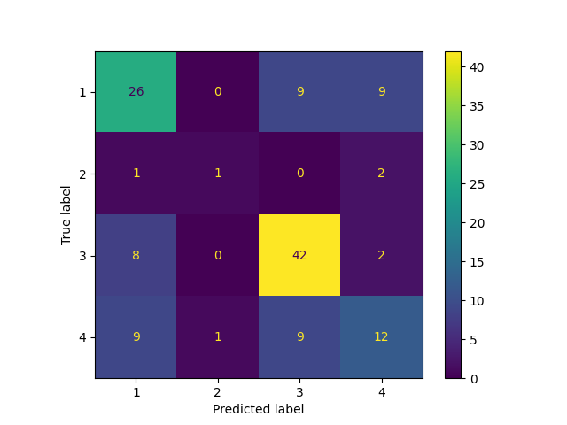

# Classification Report for Adaptive Boosting

## Parameter Search Results

|   rank_test_f1_weighted |   mean_test_f1_weighted |   mean_test_balanced_accuracy |   mean_fit_time | params                                                                                                  |
|------------------------:|------------------------:|------------------------------:|----------------:|:--------------------------------------------------------------------------------------------------------|
|                       1 |                0.58905  |                      0.481307 |      0.0827989  | {'adaboostclassifier__n_estimators': 27, 'adaboostclassifier__base_estimator': None}                    |
|                       2 |                0.580011 |                      0.452391 |      0.0360005  | {'adaboostclassifier__n_estimators': 11, 'adaboostclassifier__base_estimator': None}                    |
|                       3 |                0.576058 |                      0.471337 |      0.090999   | {'adaboostclassifier__n_estimators': 29, 'adaboostclassifier__base_estimator': None}                    |
|                       4 |                0.56229  |                      0.464939 |      0.650303   | {'adaboostclassifier__n_estimators': 228, 'adaboostclassifier__base_estimator': None}                   |
|                       5 |                0.560894 |                      0.464705 |      0.679399   | {'adaboostclassifier__n_estimators': 237, 'adaboostclassifier__base_estimator': None}                   |
|                       6 |                0.560334 |                      0.441914 |      0.0448039  | {'adaboostclassifier__n_estimators': 13, 'adaboostclassifier__base_estimator': None}                    |
|                       7 |                0.559298 |                      0.457871 |      0.263798   | {'adaboostclassifier__n_estimators': 94, 'adaboostclassifier__base_estimator': None}                    |
|                       8 |                0.558502 |                      0.463586 |      0.700206   | {'adaboostclassifier__n_estimators': 244, 'adaboostclassifier__base_estimator': None}                   |
|                       9 |                0.55611  |                      0.454032 |      0.538399   | {'adaboostclassifier__n_estimators': 188, 'adaboostclassifier__base_estimator': None}                   |
|                      10 |                0.556043 |                      0.45564  |      0.5412     | {'adaboostclassifier__n_estimators': 195, 'adaboostclassifier__base_estimator': None}                   |
|                      11 |                0.554621 |                      0.459031 |      0.657999   | {'adaboostclassifier__n_estimators': 229, 'adaboostclassifier__base_estimator': None}                   |
|                      12 |                0.554199 |                      0.455282 |      0.104      | {'adaboostclassifier__n_estimators': 33, 'adaboostclassifier__base_estimator': None}                    |
|                      13 |                0.553287 |                      0.452091 |      0.928201   | {'adaboostclassifier__n_estimators': 338, 'adaboostclassifier__base_estimator': None}                   |
|                      14 |                0.552469 |                      0.454563 |      0.297216   | {'adaboostclassifier__n_estimators': 101, 'adaboostclassifier__base_estimator': None}                   |
|                      15 |                0.551675 |                      0.460596 |      0.814599   | {'adaboostclassifier__n_estimators': 290, 'adaboostclassifier__base_estimator': None}                   |
|                      16 |                0.551429 |                      0.454061 |      1.027      | {'adaboostclassifier__n_estimators': 352, 'adaboostclassifier__base_estimator': None}                   |
|                      17 |                0.549644 |                      0.45124  |      0.299398   | {'adaboostclassifier__n_estimators': 102, 'adaboostclassifier__base_estimator': None}                   |
|                      18 |                0.549139 |                      0.454427 |      1.1514     | {'adaboostclassifier__n_estimators': 398, 'adaboostclassifier__base_estimator': None}                   |
|                      19 |                0.548865 |                      0.454116 |      1.2428     | {'adaboostclassifier__n_estimators': 391, 'adaboostclassifier__base_estimator': None}                   |
|                      20 |                0.548117 |                      0.456631 |      0.569199   | {'adaboostclassifier__n_estimators': 204, 'adaboostclassifier__base_estimator': None}                   |
|                      21 |                0.5454   |                      0.452981 |      0.581198   | {'adaboostclassifier__n_estimators': 205, 'adaboostclassifier__base_estimator': None}                   |
|                      22 |                0.545156 |                      0.459959 |      0.3918     | {'adaboostclassifier__n_estimators': 131, 'adaboostclassifier__base_estimator': None}                   |
|                      23 |                0.544733 |                      0.449874 |      0.255597   | {'adaboostclassifier__n_estimators': 89, 'adaboostclassifier__base_estimator': None}                    |
|                      24 |                0.544149 |                      0.448871 |      1.035      | {'adaboostclassifier__n_estimators': 383, 'adaboostclassifier__base_estimator': None}                   |
|                      25 |                0.543219 |                      0.449893 |      0.573799   | {'adaboostclassifier__n_estimators': 206, 'adaboostclassifier__base_estimator': None}                   |
|                      26 |                0.543204 |                      0.452471 |      0.7298     | {'adaboostclassifier__n_estimators': 259, 'adaboostclassifier__base_estimator': None}                   |
|                      27 |                0.539485 |                      0.442183 |      0.482599   | {'adaboostclassifier__n_estimators': 170, 'adaboostclassifier__base_estimator': None}                   |
|                      28 |                0.538671 |                      0.448024 |      1.0828     | {'adaboostclassifier__n_estimators': 424, 'adaboostclassifier__base_estimator': None}                   |
|                      29 |                0.538049 |                      0.441339 |      0.2108     | {'adaboostclassifier__n_estimators': 77, 'adaboostclassifier__base_estimator': None}                    |
|                      30 |                0.537008 |                      0.446747 |      0.613006   | {'adaboostclassifier__n_estimators': 215, 'adaboostclassifier__base_estimator': None}                   |
|                      31 |                0.534767 |                      0.445503 |      0.889599   | {'adaboostclassifier__n_estimators': 317, 'adaboostclassifier__base_estimator': None}                   |
|                      32 |                0.534464 |                      0.442046 |      0.59861    | {'adaboostclassifier__n_estimators': 214, 'adaboostclassifier__base_estimator': None}                   |
|                      33 |                0.533417 |                      0.432128 |      0.156199   | {'adaboostclassifier__n_estimators': 53, 'adaboostclassifier__base_estimator': None}                    |
|                      34 |                0.533413 |                      0.438509 |      0.564799   | {'adaboostclassifier__n_estimators': 172, 'adaboostclassifier__base_estimator': None}                   |
|                      35 |                0.522581 |                      0.465132 |      0.6086     | {'adaboostclassifier__n_estimators': 72, 'adaboostclassifier__base_estimator': LogisticRegression()}    |
|                      36 |                0.522323 |                      0.46615  |      0.6088     | {'adaboostclassifier__n_estimators': 76, 'adaboostclassifier__base_estimator': LogisticRegression()}    |
|                      37 |                0.520737 |                      0.464537 |      0.6544     | {'adaboostclassifier__n_estimators': 81, 'adaboostclassifier__base_estimator': LogisticRegression()}    |
|                      38 |                0.514451 |                      0.475942 |      0.743      | {'adaboostclassifier__n_estimators': 92, 'adaboostclassifier__base_estimator': LogisticRegression()}    |
|                      39 |                0.511634 |                      0.473164 |      0.6928     | {'adaboostclassifier__n_estimators': 89, 'adaboostclassifier__base_estimator': LogisticRegression()}    |
|                      40 |                0.510239 |                      0.405464 |      0.0133995  | {'adaboostclassifier__n_estimators': 3, 'adaboostclassifier__base_estimator': None}                     |
|                      41 |                0.508286 |                      0.435024 |      0.480999   | {'adaboostclassifier__n_estimators': 56, 'adaboostclassifier__base_estimator': LogisticRegression()}    |
|                      42 |                0.508012 |                      0.434005 |      0.494587   | {'adaboostclassifier__n_estimators': 53, 'adaboostclassifier__base_estimator': LogisticRegression()}    |
|                      43 |                0.507605 |                      0.468686 |      1.4902     | {'adaboostclassifier__n_estimators': 180, 'adaboostclassifier__base_estimator': LogisticRegression()}   |
|                      44 |                0.507326 |                      0.468686 |      1.5058     | {'adaboostclassifier__n_estimators': 188, 'adaboostclassifier__base_estimator': LogisticRegression()}   |
|                      45 |                0.50709  |                      0.480652 |      1.646      | {'adaboostclassifier__n_estimators': 207, 'adaboostclassifier__base_estimator': LogisticRegression()}   |
|                      46 |                0.506567 |                      0.427526 |      0.312199   | {'adaboostclassifier__n_estimators': 38, 'adaboostclassifier__base_estimator': LogisticRegression()}    |
|                      47 |                0.506523 |                      0.467521 |      1.1108     | {'adaboostclassifier__n_estimators': 136, 'adaboostclassifier__base_estimator': LogisticRegression()}   |
|                      48 |                0.506417 |                      0.480652 |      1.633      | {'adaboostclassifier__n_estimators': 204, 'adaboostclassifier__base_estimator': LogisticRegression()}   |
|                      49 |                0.505773 |                      0.468376 |      0.9582     | {'adaboostclassifier__n_estimators': 119, 'adaboostclassifier__base_estimator': LogisticRegression()}   |
|                      50 |                0.505701 |                      0.468376 |      1.0304     | {'adaboostclassifier__n_estimators': 128, 'adaboostclassifier__base_estimator': LogisticRegression()}   |
|                      51 |                0.504025 |                      0.465908 |      1.3118     | {'adaboostclassifier__n_estimators': 161, 'adaboostclassifier__base_estimator': LogisticRegression()}   |
|                      52 |                0.497188 |                      0.474174 |      1.9234     | {'adaboostclassifier__n_estimators': 237, 'adaboostclassifier__base_estimator': LogisticRegression()}   |
|                      52 |                0.497188 |                      0.474174 |      1.89251    | {'adaboostclassifier__n_estimators': 241, 'adaboostclassifier__base_estimator': LogisticRegression()}   |
|                      54 |                0.49496  |                      0.471852 |      2.1446     | {'adaboostclassifier__n_estimators': 271, 'adaboostclassifier__base_estimator': LogisticRegression()}   |
|                      55 |                0.494432 |                      0.471542 |      2.0328     | {'adaboostclassifier__n_estimators': 255, 'adaboostclassifier__base_estimator': LogisticRegression()}   |
|                      56 |                0.492995 |                      0.47029  |      2.25772    | {'adaboostclassifier__n_estimators': 292, 'adaboostclassifier__base_estimator': LogisticRegression()}   |
|                      57 |                0.492066 |                      0.44534  |      2.5162     | {'adaboostclassifier__n_estimators': 324, 'adaboostclassifier__base_estimator': LogisticRegression()}   |
|                      58 |                0.491691 |                      0.44534  |      2.34121    | {'adaboostclassifier__n_estimators': 303, 'adaboostclassifier__base_estimator': LogisticRegression()}   |
|                      59 |                0.486003 |                      0.440786 |      2.6788     | {'adaboostclassifier__n_estimators': 340, 'adaboostclassifier__base_estimator': LogisticRegression()}   |
|                      59 |                0.486003 |                      0.440786 |      2.60241    | {'adaboostclassifier__n_estimators': 337, 'adaboostclassifier__base_estimator': LogisticRegression()}   |
|                      61 |                0.483458 |                      0.436592 |      3.0502     | {'adaboostclassifier__n_estimators': 392, 'adaboostclassifier__base_estimator': LogisticRegression()}   |
|                      61 |                0.483458 |                      0.436592 |      3.2124     | {'adaboostclassifier__n_estimators': 385, 'adaboostclassifier__base_estimator': LogisticRegression()}   |
|                      63 |                0.479937 |                      0.434668 |      3.21832    | {'adaboostclassifier__n_estimators': 426, 'adaboostclassifier__base_estimator': LogisticRegression()}   |
|                      64 |                0.469759 |                      0.443098 |      3.4966     | {'adaboostclassifier__n_estimators': 466, 'adaboostclassifier__base_estimator': LogisticRegression()}   |
|                      65 |              nan        |                    nan        |      0.00460062 | {'adaboostclassifier__n_estimators': 334, 'adaboostclassifier__base_estimator': KNeighborsClassifier()} |
|                      66 |              nan        |                    nan        |      0.00459976 | {'adaboostclassifier__n_estimators': 438, 'adaboostclassifier__base_estimator': KNeighborsClassifier()} |
|                      67 |              nan        |                    nan        |      0.00519996 | {'adaboostclassifier__n_estimators': 467, 'adaboostclassifier__base_estimator': KNeighborsClassifier()} |
|                      68 |              nan        |                    nan        |      0.00400052 | {'adaboostclassifier__n_estimators': 11, 'adaboostclassifier__base_estimator': KNeighborsClassifier()}  |
|                      69 |              nan        |                    nan        |      0.00500021 | {'adaboostclassifier__n_estimators': 175, 'adaboostclassifier__base_estimator': KNeighborsClassifier()} |
|                      70 |              nan        |                    nan        |      0.00420036 | {'adaboostclassifier__n_estimators': 338, 'adaboostclassifier__base_estimator': KNeighborsClassifier()} |
|                      71 |              nan        |                    nan        |      0.00459886 | {'adaboostclassifier__n_estimators': 366, 'adaboostclassifier__base_estimator': KNeighborsClassifier()} |
|                      72 |              nan        |                    nan        |      0.00439987 | {'adaboostclassifier__n_estimators': 414, 'adaboostclassifier__base_estimator': KNeighborsClassifier()} |
|                      73 |              nan        |                    nan        |      0.00560012 | {'adaboostclassifier__n_estimators': 291, 'adaboostclassifier__base_estimator': KNeighborsClassifier()} |
|                      74 |              nan        |                    nan        |      0.00439916 | {'adaboostclassifier__n_estimators': 375, 'adaboostclassifier__base_estimator': KNeighborsClassifier()} |
|                      75 |              nan        |                    nan        |      0.00459943 | {'adaboostclassifier__n_estimators': 465, 'adaboostclassifier__base_estimator': KNeighborsClassifier()} |
|                      76 |              nan        |                    nan        |      0.00459986 | {'adaboostclassifier__n_estimators': 310, 'adaboostclassifier__base_estimator': KNeighborsClassifier()} |
|                      77 |              nan        |                    nan        |      0.00479908 | {'adaboostclassifier__n_estimators': 303, 'adaboostclassifier__base_estimator': KNeighborsClassifier()} |
|                      78 |              nan        |                    nan        |      0.00920143 | {'adaboostclassifier__n_estimators': 12, 'adaboostclassifier__base_estimator': KNeighborsClassifier()}  |
|                      79 |              nan        |                    nan        |      0.00480065 | {'adaboostclassifier__n_estimators': 480, 'adaboostclassifier__base_estimator': KNeighborsClassifier()} |
|                      80 |              nan        |                    nan        |      0.0041997  | {'adaboostclassifier__n_estimators': 289, 'adaboostclassifier__base_estimator': KNeighborsClassifier()} |
|                      81 |              nan        |                    nan        |      0.00419865 | {'adaboostclassifier__n_estimators': 474, 'adaboostclassifier__base_estimator': KNeighborsClassifier()} |
|                      82 |              nan        |                    nan        |      0.00460048 | {'adaboostclassifier__n_estimators': 203, 'adaboostclassifier__base_estimator': KNeighborsClassifier()} |
|                      83 |              nan        |                    nan        |      0.00479903 | {'adaboostclassifier__n_estimators': 381, 'adaboostclassifier__base_estimator': KNeighborsClassifier()} |
|                      84 |              nan        |                    nan        |      0.00400071 | {'adaboostclassifier__n_estimators': 351, 'adaboostclassifier__base_estimator': KNeighborsClassifier()} |
|                      85 |              nan        |                    nan        |      0.00419888 | {'adaboostclassifier__n_estimators': 376, 'adaboostclassifier__base_estimator': KNeighborsClassifier()} |
|                      86 |              nan        |                    nan        |      0.00439925 | {'adaboostclassifier__n_estimators': 485, 'adaboostclassifier__base_estimator': KNeighborsClassifier()} |
|                      87 |              nan        |                    nan        |      0.00479946 | {'adaboostclassifier__n_estimators': 36, 'adaboostclassifier__base_estimator': KNeighborsClassifier()}  |
|                      88 |              nan        |                    nan        |      0.00499935 | {'adaboostclassifier__n_estimators': 78, 'adaboostclassifier__base_estimator': KNeighborsClassifier()}  |
|                      89 |              nan        |                    nan        |      0.00479937 | {'adaboostclassifier__n_estimators': 295, 'adaboostclassifier__base_estimator': KNeighborsClassifier()} |
|                      90 |              nan        |                    nan        |      0.00499935 | {'adaboostclassifier__n_estimators': 357, 'adaboostclassifier__base_estimator': KNeighborsClassifier()} |
|                      91 |              nan        |                    nan        |      0.00499964 | {'adaboostclassifier__n_estimators': 396, 'adaboostclassifier__base_estimator': KNeighborsClassifier()} |
|                      92 |              nan        |                    nan        |      0.00539961 | {'adaboostclassifier__n_estimators': 53, 'adaboostclassifier__base_estimator': KNeighborsClassifier()}  |
|                      93 |              nan        |                    nan        |      0.00440063 | {'adaboostclassifier__n_estimators': 16, 'adaboostclassifier__base_estimator': KNeighborsClassifier()}  |
|                      94 |              nan        |                    nan        |      0.00420036 | {'adaboostclassifier__n_estimators': 202, 'adaboostclassifier__base_estimator': KNeighborsClassifier()} |
|                      95 |              nan        |                    nan        |      0.00460043 | {'adaboostclassifier__n_estimators': 119, 'adaboostclassifier__base_estimator': KNeighborsClassifier()} |
|                      96 |              nan        |                    nan        |      0.00479932 | {'adaboostclassifier__n_estimators': 391, 'adaboostclassifier__base_estimator': KNeighborsClassifier()} |
|                      97 |              nan        |                    nan        |      0.00479994 | {'adaboostclassifier__n_estimators': 257, 'adaboostclassifier__base_estimator': KNeighborsClassifier()} |
|                      98 |              nan        |                    nan        |      0.00479932 | {'adaboostclassifier__n_estimators': 306, 'adaboostclassifier__base_estimator': KNeighborsClassifier()} |
|                      99 |              nan        |                    nan        |      0.00479984 | {'adaboostclassifier__n_estimators': 51, 'adaboostclassifier__base_estimator': KNeighborsClassifier()}  |
|                     100 |              nan        |                    nan        |      0.00419884 | {'adaboostclassifier__n_estimators': 420, 'adaboostclassifier__base_estimator': KNeighborsClassifier()} |

## Best Classifier Found

```
Pipeline(steps=[('standardscaler', StandardScaler()),
                ('adaboostclassifier', AdaBoostClassifier(n_estimators=27))])
{'adaboostclassifier__n_estimators': 27, 'adaboostclassifier__base_estimator': None}
```

### Training report

```
              precision    recall  f1-score   support

           1       0.85      0.62      0.72       130
           2       0.45      0.36      0.40        14
           3       0.67      0.81      0.74       156
           4       0.55      0.58      0.56        92

    accuracy                           0.68       392
   macro avg       0.63      0.59      0.60       392
weighted avg       0.69      0.68      0.68       392
```

### Testing report

```
              precision    recall  f1-score   support

           1       0.59      0.59      0.59        44
           2       0.50      0.25      0.33         4
           3       0.70      0.81      0.75        52
           4       0.48      0.39      0.43        31

    accuracy                           0.62       131
   macro avg       0.57      0.51      0.53       131
weighted avg       0.61      0.62      0.61       131
```
### Confusion matrix



