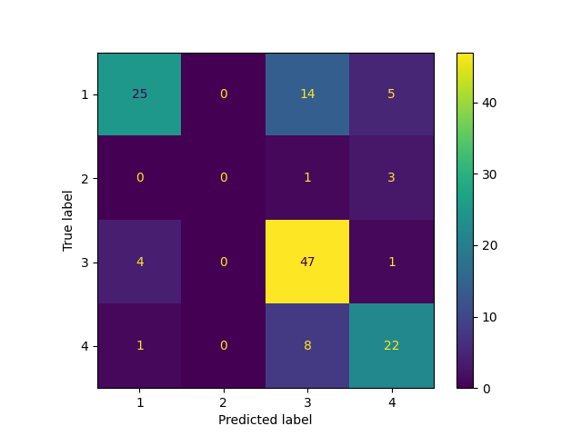

# Classification Report for Bagging

## Parameter Search Results

|   rank_test_f1_weighted |   mean_test_f1_weighted |   mean_test_balanced_accuracy |   mean_fit_time | params                                                                                                                                                                                                               |
|------------------------:|------------------------:|------------------------------:|----------------:|:---------------------------------------------------------------------------------------------------------------------------------------------------------------------------------------------------------------------|
|                       1 |                0.664766 |                      0.56102  |       2.2036    | {'baggingclassifier__base_estimator': LogisticRegression(), 'baggingclassifier__max_features': 0.9585799791154637, 'baggingclassifier__max_samples': 0.7381075229817785, 'baggingclassifier__n_estimators': 55}      |
|                       2 |                0.664233 |                      0.536858 |       0.6012    | {'baggingclassifier__base_estimator': None, 'baggingclassifier__max_features': 0.7924077121195074, 'baggingclassifier__max_samples': 0.6469515696785071, 'baggingclassifier__n_estimators': 137}                     |
|                       3 |                0.664215 |                      0.513123 |       1.1314    | {'baggingclassifier__base_estimator': None, 'baggingclassifier__max_features': 0.7149717488405907, 'baggingclassifier__max_samples': 0.8829965879956866, 'baggingclassifier__n_estimators': 231}                     |
|                       4 |                0.661438 |                      0.536461 |       1.297     | {'baggingclassifier__base_estimator': None, 'baggingclassifier__max_features': 0.8488137831716701, 'baggingclassifier__max_samples': 0.8376304797909919, 'baggingclassifier__n_estimators': 245}                     |
|                       5 |                0.660971 |                      0.557407 |      13.4588    | {'baggingclassifier__base_estimator': LogisticRegression(), 'baggingclassifier__max_features': 0.8097312328541351, 'baggingclassifier__max_samples': 0.5445958055810808, 'baggingclassifier__n_estimators': 354}     |
|                       6 |                0.658977 |                      0.533121 |       1.475     | {'baggingclassifier__base_estimator': None, 'baggingclassifier__max_features': 0.8704061291502592, 'baggingclassifier__max_samples': 0.9173999261904562, 'baggingclassifier__n_estimators': 260}                     |
|                       7 |                0.657989 |                      0.534139 |       1.7158    | {'baggingclassifier__base_estimator': None, 'baggingclassifier__max_features': 0.8845464989657569, 'baggingclassifier__max_samples': 0.608601596036552, 'baggingclassifier__n_estimators': 382}                      |
|                       8 |                0.657502 |                      0.513695 |       1.5032    | {'baggingclassifier__base_estimator': None, 'baggingclassifier__max_features': 0.9398698975671503, 'baggingclassifier__max_samples': 0.5702235862691573, 'baggingclassifier__n_estimators': 337}                     |
|                       9 |                0.657078 |                      0.533595 |       2.4448    | {'baggingclassifier__base_estimator': None, 'baggingclassifier__max_features': 0.9193295167903356, 'baggingclassifier__max_samples': 0.8424237113736027, 'baggingclassifier__n_estimators': 437}                     |
|                      10 |                0.656756 |                      0.525572 |       8.253     | {'baggingclassifier__base_estimator': LogisticRegression(), 'baggingclassifier__max_features': 0.97668266012809, 'baggingclassifier__max_samples': 0.2942822954643458, 'baggingclassifier__n_estimators': 230}       |
|                      11 |                0.655334 |                      0.54038  |       7.35431   | {'baggingclassifier__base_estimator': LogisticRegression(), 'baggingclassifier__max_features': 0.7936320249894466, 'baggingclassifier__max_samples': 0.44511428357750826, 'baggingclassifier__n_estimators': 202}    |
|                      12 |                0.652913 |                      0.551093 |      12.4622    | {'baggingclassifier__base_estimator': LogisticRegression(), 'baggingclassifier__max_features': 0.6187191250939836, 'baggingclassifier__max_samples': 0.8829427558476228, 'baggingclassifier__n_estimators': 333}     |
|                      13 |                0.652607 |                      0.52904  |       1.375     | {'baggingclassifier__base_estimator': None, 'baggingclassifier__max_features': 0.8086495479588236, 'baggingclassifier__max_samples': 0.9764170652703704, 'baggingclassifier__n_estimators': 242}                     |
|                      14 |                0.652202 |                      0.500158 |       0.8212    | {'baggingclassifier__base_estimator': None, 'baggingclassifier__max_features': 0.5534401315644489, 'baggingclassifier__max_samples': 0.3510719396960049, 'baggingclassifier__n_estimators': 320}                     |
|                      15 |                0.650808 |                      0.535021 |      13.0301    | {'baggingclassifier__base_estimator': LogisticRegression(), 'baggingclassifier__max_features': 0.8223184394342549, 'baggingclassifier__max_samples': 0.40423045356808873, 'baggingclassifier__n_estimators': 364}    |
|                      16 |                0.650321 |                      0.535876 |      14.0026    | {'baggingclassifier__base_estimator': LogisticRegression(), 'baggingclassifier__max_features': 0.7907462002303006, 'baggingclassifier__max_samples': 0.43272619591458084, 'baggingclassifier__n_estimators': 390}    |
|                      17 |                0.648696 |                      0.502515 |       1.6088    | {'baggingclassifier__base_estimator': None, 'baggingclassifier__max_features': 0.6479845857188883, 'baggingclassifier__max_samples': 0.8993454541308954, 'baggingclassifier__n_estimators': 342}                     |
|                      18 |                0.648507 |                      0.498425 |       0.3334    | {'baggingclassifier__base_estimator': None, 'baggingclassifier__max_features': 0.8072257589025982, 'baggingclassifier__max_samples': 0.44174130096506925, 'baggingclassifier__n_estimators': 93}                     |
|                      19 |                0.648195 |                      0.530767 |      13.3534    | {'baggingclassifier__base_estimator': LogisticRegression(), 'baggingclassifier__max_features': 0.7999583672615646, 'baggingclassifier__max_samples': 0.3318595087669606, 'baggingclassifier__n_estimators': 393}     |
|                      20 |                0.648098 |                      0.497293 |       0.979999  | {'baggingclassifier__base_estimator': None, 'baggingclassifier__max_features': 0.512706684772569, 'baggingclassifier__max_samples': 0.7256354907440015, 'baggingclassifier__n_estimators': 269}                      |
|                      21 |                0.647204 |                      0.532243 |       4.3022    | {'baggingclassifier__base_estimator': LogisticRegression(), 'baggingclassifier__max_features': 0.6016356287356396, 'baggingclassifier__max_samples': 0.6763037898154816, 'baggingclassifier__n_estimators': 122}     |
|                      22 |                0.646609 |                      0.530224 |       6.5444    | {'baggingclassifier__base_estimator': LogisticRegression(), 'baggingclassifier__max_features': 0.7753816977268619, 'baggingclassifier__max_samples': 0.3981560896135866, 'baggingclassifier__n_estimators': 187}     |
|                      23 |                0.64578  |                      0.494729 |       1.6174    | {'baggingclassifier__base_estimator': None, 'baggingclassifier__max_features': 0.4195628183546748, 'baggingclassifier__max_samples': 0.9396280403403264, 'baggingclassifier__n_estimators': 422}                     |
|                      24 |                0.645656 |                      0.49663  |       0.7882    | {'baggingclassifier__base_estimator': None, 'baggingclassifier__max_features': 0.6213667959172634, 'baggingclassifier__max_samples': 0.49657565126399583, 'baggingclassifier__n_estimators': 242}                    |
|                      25 |                0.645081 |                      0.49335  |       1.78      | {'baggingclassifier__base_estimator': None, 'baggingclassifier__max_features': 0.47117030925381675, 'baggingclassifier__max_samples': 0.954707163734038, 'baggingclassifier__n_estimators': 438}                     |
|                      26 |                0.642949 |                      0.514722 |      10.2364    | {'baggingclassifier__base_estimator': LogisticRegression(), 'baggingclassifier__max_features': 0.8739091061592249, 'baggingclassifier__max_samples': 0.3326877419579074, 'baggingclassifier__n_estimators': 290}     |
|                      27 |                0.642725 |                      0.488631 |       0.991799  | {'baggingclassifier__base_estimator': None, 'baggingclassifier__max_features': 0.3695677942614065, 'baggingclassifier__max_samples': 0.8474550953245599, 'baggingclassifier__n_estimators': 302}                     |
|                      28 |                0.641316 |                      0.510614 |       7.209     | {'baggingclassifier__base_estimator': LogisticRegression(), 'baggingclassifier__max_features': 0.7856007485886997, 'baggingclassifier__max_samples': 0.28820464319425876, 'baggingclassifier__n_estimators': 222}    |
|                      29 |                0.639263 |                      0.49393  |       0.477399  | {'baggingclassifier__base_estimator': None, 'baggingclassifier__max_features': 0.6019991709831413, 'baggingclassifier__max_samples': 0.9640901433061891, 'baggingclassifier__n_estimators': 100}                     |
|                      30 |                0.636142 |                      0.520347 |      13.6624    | {'baggingclassifier__base_estimator': LogisticRegression(), 'baggingclassifier__max_features': 0.4247209144952968, 'baggingclassifier__max_samples': 0.885354366800225, 'baggingclassifier__n_estimators': 441}      |
|                      31 |                0.630263 |                      0.478374 |       0.7704    | {'baggingclassifier__base_estimator': None, 'baggingclassifier__max_features': 0.30412323905160743, 'baggingclassifier__max_samples': 0.7599183807163699, 'baggingclassifier__n_estimators': 258}                    |
|                      32 |                0.629839 |                      0.499193 |      14.7892    | {'baggingclassifier__base_estimator': LogisticRegression(), 'baggingclassifier__max_features': 0.7037663928632433, 'baggingclassifier__max_samples': 0.27294199549722, 'baggingclassifier__n_estimators': 489}       |
|                      33 |                0.62944  |                      0.499193 |       5.116     | {'baggingclassifier__base_estimator': LogisticRegression(), 'baggingclassifier__max_features': 0.5479149840401767, 'baggingclassifier__max_samples': 0.35247006999441144, 'baggingclassifier__n_estimators': 177}    |
|                      34 |                0.627926 |                      0.498037 |      10.41      | {'baggingclassifier__base_estimator': LogisticRegression(), 'baggingclassifier__max_features': 0.5774051128678948, 'baggingclassifier__max_samples': 0.28971300922763765, 'baggingclassifier__n_estimators': 376}    |
|                      35 |                0.623291 |                      0.470782 |       0.8686    | {'baggingclassifier__base_estimator': None, 'baggingclassifier__max_features': 0.2535689240257277, 'baggingclassifier__max_samples': 0.7054496714126238, 'baggingclassifier__n_estimators': 329}                     |
|                      36 |                0.623013 |                      0.473409 |       0.195999  | {'baggingclassifier__base_estimator': None, 'baggingclassifier__max_features': 0.3562554748537028, 'baggingclassifier__max_samples': 0.2927820102750459, 'baggingclassifier__n_estimators': 99}                      |
|                      37 |                0.621455 |                      0.470023 |       1.1802    | {'baggingclassifier__base_estimator': None, 'baggingclassifier__max_features': 0.2682540385562857, 'baggingclassifier__max_samples': 0.921338883614531, 'baggingclassifier__n_estimators': 402}                      |
|                      38 |                0.615435 |                      0.489288 |       0.4818    | {'baggingclassifier__base_estimator': LogisticRegression(), 'baggingclassifier__max_features': 0.6063688232205544, 'baggingclassifier__max_samples': 0.405225204533019, 'baggingclassifier__n_estimators': 15}       |
|                      39 |                0.610834 |                      0.461488 |       0.3098    | {'baggingclassifier__base_estimator': None, 'baggingclassifier__max_features': 0.19903341547544962, 'baggingclassifier__max_samples': 0.6758250976067323, 'baggingclassifier__n_estimators': 136}                    |
|                      40 |                0.606787 |                      0.461721 |       0.3894    | {'baggingclassifier__base_estimator': KNeighborsClassifier(), 'baggingclassifier__max_features': 0.6937589515345448, 'baggingclassifier__max_samples': 0.9170481044849819, 'baggingclassifier__n_estimators': 373}   |
|                      41 |                0.600805 |                      0.4774   |       1.1922    | {'baggingclassifier__base_estimator': LogisticRegression(), 'baggingclassifier__max_features': 0.5898098934895103, 'baggingclassifier__max_samples': 0.2496072840973611, 'baggingclassifier__n_estimators': 45}      |
|                      42 |                0.600598 |                      0.455071 |       0.433     | {'baggingclassifier__base_estimator': KNeighborsClassifier(), 'baggingclassifier__max_features': 0.592625692513568, 'baggingclassifier__max_samples': 0.8362291842445977, 'baggingclassifier__n_estimators': 422}    |
|                      43 |                0.598276 |                      0.452317 |       0.2046    | {'baggingclassifier__base_estimator': KNeighborsClassifier(), 'baggingclassifier__max_features': 0.6146713529405722, 'baggingclassifier__max_samples': 0.6308335176077289, 'baggingclassifier__n_estimators': 203}   |
|                      44 |                0.597065 |                      0.451685 |       0.1102    | {'baggingclassifier__base_estimator': KNeighborsClassifier(), 'baggingclassifier__max_features': 0.7711324727677943, 'baggingclassifier__max_samples': 0.7551085421739432, 'baggingclassifier__n_estimators': 105}   |
|                      45 |                0.597031 |                      0.453458 |       0.355398  | {'baggingclassifier__base_estimator': KNeighborsClassifier(), 'baggingclassifier__max_features': 0.6055548492427136, 'baggingclassifier__max_samples': 0.8095487846867692, 'baggingclassifier__n_estimators': 332}   |
|                      46 |                0.596518 |                      0.451128 |       0.421999  | {'baggingclassifier__base_estimator': KNeighborsClassifier(), 'baggingclassifier__max_features': 0.466981207561045, 'baggingclassifier__max_samples': 0.7783450235078401, 'baggingclassifier__n_estimators': 422}    |
|                      47 |                0.595916 |                      0.451224 |       0.2198    | {'baggingclassifier__base_estimator': KNeighborsClassifier(), 'baggingclassifier__max_features': 0.46023562711477095, 'baggingclassifier__max_samples': 0.705834696493125, 'baggingclassifier__n_estimators': 223}   |
|                      48 |                0.595883 |                      0.449056 |       0.447599  | {'baggingclassifier__base_estimator': KNeighborsClassifier(), 'baggingclassifier__max_features': 0.22498256913415426, 'baggingclassifier__max_samples': 0.6410425239333446, 'baggingclassifier__n_estimators': 327}  |
|                      49 |                0.594781 |                      0.449462 |       0.1876    | {'baggingclassifier__base_estimator': KNeighborsClassifier(), 'baggingclassifier__max_features': 0.6839698131007658, 'baggingclassifier__max_samples': 0.599525529078944, 'baggingclassifier__n_estimators': 194}    |
|                      50 |                0.592406 |                      0.449229 |       0.1494    | {'baggingclassifier__base_estimator': KNeighborsClassifier(), 'baggingclassifier__max_features': 0.9900689847077473, 'baggingclassifier__max_samples': 0.6317315857657839, 'baggingclassifier__n_estimators': 140}   |
|                      51 |                0.591899 |                      0.469533 |      10.582     | {'baggingclassifier__base_estimator': LogisticRegression(), 'baggingclassifier__max_features': 0.8172637619541651, 'baggingclassifier__max_samples': 0.16109921495114665, 'baggingclassifier__n_estimators': 353}    |
|                      52 |                0.591214 |                      0.448255 |       0.0205983 | {'baggingclassifier__base_estimator': KNeighborsClassifier(), 'baggingclassifier__max_features': 0.2946177442083213, 'baggingclassifier__max_samples': 0.7037708082857792, 'baggingclassifier__n_estimators': 15}    |
|                      53 |                0.589636 |                      0.446582 |       0.0909998 | {'baggingclassifier__base_estimator': KNeighborsClassifier(), 'baggingclassifier__max_features': 0.9011858997245443, 'baggingclassifier__max_samples': 0.7983675523166278, 'baggingclassifier__n_estimators': 87}    |
|                      54 |                0.589318 |                      0.446168 |       0.2334    | {'baggingclassifier__base_estimator': KNeighborsClassifier(), 'baggingclassifier__max_features': 0.2176643140390695, 'baggingclassifier__max_samples': 0.8394909577598304, 'baggingclassifier__n_estimators': 141}   |
|                      55 |                0.588531 |                      0.444677 |       0.1262    | {'baggingclassifier__base_estimator': KNeighborsClassifier(), 'baggingclassifier__max_features': 0.3067723035183272, 'baggingclassifier__max_samples': 0.971909114344009, 'baggingclassifier__n_estimators': 127}    |
|                      56 |                0.588452 |                      0.444759 |       0.372801  | {'baggingclassifier__base_estimator': KNeighborsClassifier(), 'baggingclassifier__max_features': 0.9705615663421675, 'baggingclassifier__max_samples': 0.6563078335199216, 'baggingclassifier__n_estimators': 351}   |
|                      57 |                0.587649 |                      0.443344 |       0.4472    | {'baggingclassifier__base_estimator': KNeighborsClassifier(), 'baggingclassifier__max_features': 0.12167237112530083, 'baggingclassifier__max_samples': 0.7963530121895138, 'baggingclassifier__n_estimators': 333}  |
|                      58 |                0.580693 |                      0.436411 |       0.103     | {'baggingclassifier__base_estimator': None, 'baggingclassifier__max_features': 0.12162856785684051, 'baggingclassifier__max_samples': 0.35408012370555475, 'baggingclassifier__n_estimators': 58}                    |
|                      59 |                0.577623 |                      0.434303 |       0.0302    | {'baggingclassifier__base_estimator': KNeighborsClassifier(), 'baggingclassifier__max_features': 0.3517043226794305, 'baggingclassifier__max_samples': 0.3896507289965274, 'baggingclassifier__n_estimators': 28}    |
|                      60 |                0.576161 |                      0.433733 |       0.3016    | {'baggingclassifier__base_estimator': KNeighborsClassifier(), 'baggingclassifier__max_features': 0.16076954068214244, 'baggingclassifier__max_samples': 0.4849539344416204, 'baggingclassifier__n_estimators': 250}  |
|                      61 |                0.57581  |                      0.433709 |       0.0819988 | {'baggingclassifier__base_estimator': KNeighborsClassifier(), 'baggingclassifier__max_features': 0.22152295131210853, 'baggingclassifier__max_samples': 0.49493260950692985, 'baggingclassifier__n_estimators': 65}  |
|                      62 |                0.574108 |                      0.456585 |      12.5662    | {'baggingclassifier__base_estimator': LogisticRegression(), 'baggingclassifier__max_features': 0.9603875824514118, 'baggingclassifier__max_samples': 0.0990592194401827, 'baggingclassifier__n_estimators': 425}     |
|                      63 |                0.573686 |                      0.454963 |      13.0314    | {'baggingclassifier__base_estimator': LogisticRegression(), 'baggingclassifier__max_features': 0.2824050301341191, 'baggingclassifier__max_samples': 0.6590557601805758, 'baggingclassifier__n_estimators': 491}     |
|                      64 |                0.573617 |                      0.430868 |       0.3998    | {'baggingclassifier__base_estimator': KNeighborsClassifier(), 'baggingclassifier__max_features': 0.8699155645565767, 'baggingclassifier__max_samples': 0.3971845464259395, 'baggingclassifier__n_estimators': 402}   |
|                      65 |                0.56995  |                      0.452194 |       2.4812    | {'baggingclassifier__base_estimator': LogisticRegression(), 'baggingclassifier__max_features': 0.397667967711007, 'baggingclassifier__max_samples': 0.3725588080789557, 'baggingclassifier__n_estimators': 101}      |
|                      66 |                0.569129 |                      0.426912 |       0.0828005 | {'baggingclassifier__base_estimator': KNeighborsClassifier(), 'baggingclassifier__max_features': 0.4813656090681323, 'baggingclassifier__max_samples': 0.3142623578449837, 'baggingclassifier__n_estimators': 83}    |
|                      67 |                0.565549 |                      0.423477 |       0.3052    | {'baggingclassifier__base_estimator': KNeighborsClassifier(), 'baggingclassifier__max_features': 0.8819898637208106, 'baggingclassifier__max_samples': 0.28640665983803615, 'baggingclassifier__n_estimators': 319}  |
|                      68 |                0.561141 |                      0.4217   |       0.3484    | {'baggingclassifier__base_estimator': KNeighborsClassifier(), 'baggingclassifier__max_features': 0.7062052742329088, 'baggingclassifier__max_samples': 0.2977152761068119, 'baggingclassifier__n_estimators': 356}   |
|                      69 |                0.560337 |                      0.424118 |       0.2242    | {'baggingclassifier__base_estimator': LogisticRegression(), 'baggingclassifier__max_features': 0.16199738583909906, 'baggingclassifier__max_samples': 0.7785520673831178, 'baggingclassifier__n_estimators': 10}     |
|                      70 |                0.560006 |                      0.420535 |       0.3064    | {'baggingclassifier__base_estimator': KNeighborsClassifier(), 'baggingclassifier__max_features': 0.7194386180345054, 'baggingclassifier__max_samples': 0.2801477319185516, 'baggingclassifier__n_estimators': 316}   |
|                      71 |                0.553715 |                      0.417284 |       0.5756    | {'baggingclassifier__base_estimator': None, 'baggingclassifier__max_features': 0.21905860127343257, 'baggingclassifier__max_samples': 0.10366741164247484, 'baggingclassifier__n_estimators': 380}                   |
|                      72 |                0.551717 |                      0.438338 |       6.4512    | {'baggingclassifier__base_estimator': LogisticRegression(), 'baggingclassifier__max_features': 0.2329007544810291, 'baggingclassifier__max_samples': 0.5897614960762778, 'baggingclassifier__n_estimators': 285}     |
|                      73 |                0.551443 |                      0.438484 |       7.6054    | {'baggingclassifier__base_estimator': LogisticRegression(), 'baggingclassifier__max_features': 0.2326371054480285, 'baggingclassifier__max_samples': 0.7256196464274591, 'baggingclassifier__n_estimators': 310}     |
|                      74 |                0.551188 |                      0.416917 |       0.0897996 | {'baggingclassifier__base_estimator': None, 'baggingclassifier__max_features': 0.03698165486796268, 'baggingclassifier__max_samples': 0.46511151280404983, 'baggingclassifier__n_estimators': 53}                    |
|                      75 |                0.550296 |                      0.437319 |       4.4626    | {'baggingclassifier__base_estimator': LogisticRegression(), 'baggingclassifier__max_features': 0.18900547380837696, 'baggingclassifier__max_samples': 0.8764311628549047, 'baggingclassifier__n_estimators': 186}    |
|                      76 |                0.549846 |                      0.416645 |       2.1882    | {'baggingclassifier__base_estimator': LogisticRegression(), 'baggingclassifier__max_features': 0.9784846129205863, 'baggingclassifier__max_samples': 0.05424436818654532, 'baggingclassifier__n_estimators': 79}     |
|                      77 |                0.547541 |                      0.437825 |       2.7286    | {'baggingclassifier__base_estimator': LogisticRegression(), 'baggingclassifier__max_features': 0.5696632246965294, 'baggingclassifier__max_samples': 0.09869564128246888, 'baggingclassifier__n_estimators': 112}    |
|                      78 |                0.546527 |                      0.414128 |      11.2232    | {'baggingclassifier__base_estimator': LogisticRegression(), 'baggingclassifier__max_features': 0.9775556012536368, 'baggingclassifier__max_samples': 0.06501163831377876, 'baggingclassifier__n_estimators': 386}    |
|                      79 |                0.539551 |                      0.431201 |       1.9978    | {'baggingclassifier__base_estimator': LogisticRegression(), 'baggingclassifier__max_features': 0.1973981745352773, 'baggingclassifier__max_samples': 0.7427081152884314, 'baggingclassifier__n_estimators': 89}      |
|                      80 |                0.537043 |                      0.403344 |       0.0417996 | {'baggingclassifier__base_estimator': KNeighborsClassifier(), 'baggingclassifier__max_features': 0.9159175686878798, 'baggingclassifier__max_samples': 0.25685749406132574, 'baggingclassifier__n_estimators': 38}   |
|                      81 |                0.536718 |                      0.402498 |       0.1878    | {'baggingclassifier__base_estimator': KNeighborsClassifier(), 'baggingclassifier__max_features': 0.5964986922272179, 'baggingclassifier__max_samples': 0.26587055910048574, 'baggingclassifier__n_estimators': 197}  |
|                      82 |                0.526465 |                      0.399723 |       3.7668    | {'baggingclassifier__base_estimator': LogisticRegression(), 'baggingclassifier__max_features': 0.1514735233870409, 'baggingclassifier__max_samples': 0.8042514367033443, 'baggingclassifier__n_estimators': 180}     |
|                      83 |                0.525522 |                      0.421188 |       5.97452   | {'baggingclassifier__base_estimator': LogisticRegression(), 'baggingclassifier__max_features': 0.17512543253038237, 'baggingclassifier__max_samples': 0.5819076261523971, 'baggingclassifier__n_estimators': 306}    |
|                      84 |                0.517997 |                      0.394624 |       6.8408    | {'baggingclassifier__base_estimator': LogisticRegression(), 'baggingclassifier__max_features': 0.3028394188384784, 'baggingclassifier__max_samples': 0.16362957701102576, 'baggingclassifier__n_estimators': 361}    |
|                      85 |                0.502242 |                      0.379889 |       0.2724    | {'baggingclassifier__base_estimator': KNeighborsClassifier(), 'baggingclassifier__max_features': 0.8496300036952633, 'baggingclassifier__max_samples': 0.16175555156411314, 'baggingclassifier__n_estimators': 293}  |
|                      86 |                0.499431 |                      0.379985 |       0.263799  | {'baggingclassifier__base_estimator': KNeighborsClassifier(), 'baggingclassifier__max_features': 0.27758964254383267, 'baggingclassifier__max_samples': 0.19169785531278138, 'baggingclassifier__n_estimators': 249} |
|                      87 |                0.496485 |                      0.403959 |       6.6496    | {'baggingclassifier__base_estimator': LogisticRegression(), 'baggingclassifier__max_features': 0.19875329498627847, 'baggingclassifier__max_samples': 0.22544039825219975, 'baggingclassifier__n_estimators': 429}   |
|                      88 |                0.490417 |                      0.400966 |       0.9022    | {'baggingclassifier__base_estimator': LogisticRegression(), 'baggingclassifier__max_features': 0.34700476620209597, 'baggingclassifier__max_samples': 0.07931268120152357, 'baggingclassifier__n_estimators': 50}    |
|                      89 |                0.483909 |                      0.399591 |       0.907599  | {'baggingclassifier__base_estimator': LogisticRegression(), 'baggingclassifier__max_features': 0.0960052684689282, 'baggingclassifier__max_samples': 0.5874459380380614, 'baggingclassifier__n_estimators': 66}      |
|                      90 |                0.478546 |                      0.368847 |       0.4706    | {'baggingclassifier__base_estimator': KNeighborsClassifier(), 'baggingclassifier__max_features': 0.8534360888062009, 'baggingclassifier__max_samples': 0.14426377974958537, 'baggingclassifier__n_estimators': 491}  |
|                      91 |                0.46974  |                      0.35588  |       0.325599  | {'baggingclassifier__base_estimator': KNeighborsClassifier(), 'baggingclassifier__max_features': 0.023900397551576802, 'baggingclassifier__max_samples': 0.9662287403884727, 'baggingclassifier__n_estimators': 273} |
|                      92 |                0.465096 |                      0.362535 |       0.7732    | {'baggingclassifier__base_estimator': LogisticRegression(), 'baggingclassifier__max_features': 0.0999319356170918, 'baggingclassifier__max_samples': 0.6024480120647602, 'baggingclassifier__n_estimators': 49}      |
|                      93 |                0.463025 |                      0.388103 |       2.6204    | {'baggingclassifier__base_estimator': LogisticRegression(), 'baggingclassifier__max_features': 0.05530477345447549, 'baggingclassifier__max_samples': 0.32247320456602013, 'baggingclassifier__n_estimators': 253}   |
|                      94 |                0.460542 |                      0.357833 |       0.4612    | {'baggingclassifier__base_estimator': KNeighborsClassifier(), 'baggingclassifier__max_features': 0.6900815932999732, 'baggingclassifier__max_samples': 0.11650389102587444, 'baggingclassifier__n_estimators': 498}  |
|                      95 |                0.457049 |                      0.362159 |       4.021     | {'baggingclassifier__base_estimator': LogisticRegression(), 'baggingclassifier__max_features': 0.2929564146991789, 'baggingclassifier__max_samples': 0.023648428524066234, 'baggingclassifier__n_estimators': 279}   |
|                      96 |                0.454322 |                      0.353627 |       0.0375995 | {'baggingclassifier__base_estimator': KNeighborsClassifier(), 'baggingclassifier__max_features': 0.9086703995266842, 'baggingclassifier__max_samples': 0.09229959067385152, 'baggingclassifier__n_estimators': 35}   |
|                      97 |                0.443815 |                      0.336427 |       0.455597  | {'baggingclassifier__base_estimator': KNeighborsClassifier(), 'baggingclassifier__max_features': 0.00433322993363261, 'baggingclassifier__max_samples': 0.45112703301546586, 'baggingclassifier__n_estimators': 399} |
|                      98 |                0.440878 |                      0.331884 |       0.243599  | {'baggingclassifier__base_estimator': None, 'baggingclassifier__max_features': 0.01115332184437956, 'baggingclassifier__max_samples': 0.8407870210061695, 'baggingclassifier__n_estimators': 152}                    |
|                      99 |                0.422841 |                      0.320679 |       0.102401  | {'baggingclassifier__base_estimator': KNeighborsClassifier(), 'baggingclassifier__max_features': 0.0038500344287968336, 'baggingclassifier__max_samples': 0.5370552444957798, 'baggingclassifier__n_estimators': 92} |
|                     100 |                0.409175 |                      0.332692 |       0.411599  | {'baggingclassifier__base_estimator': KNeighborsClassifier(), 'baggingclassifier__max_features': 0.2554632268831327, 'baggingclassifier__max_samples': 0.04196603489924011, 'baggingclassifier__n_estimators': 384}  |

## Best Classifier Found

```
Pipeline(steps=[('standardscaler', StandardScaler()),
                ('baggingclassifier',
                 BaggingClassifier(base_estimator=LogisticRegression(),
                                   max_features=0.9585799791154637,
                                   max_samples=0.7381075229817785,
                                   n_estimators=55))])
{'baggingclassifier__base_estimator': LogisticRegression(), 'baggingclassifier__max_features': 0.9585799791154637, 'baggingclassifier__max_samples': 0.7381075229817785, 'baggingclassifier__n_estimators': 55}
```

### Training report

```
              precision    recall  f1-score   support

           1       0.83      0.55      0.66       130
           2       0.80      0.29      0.42        14
           3       0.62      0.90      0.74       156
           4       0.70      0.59      0.64        92

    accuracy                           0.69       392
   macro avg       0.74      0.58      0.61       392
weighted avg       0.72      0.69      0.68       392
```

### Testing report

```
              precision    recall  f1-score   support

           1       0.83      0.57      0.68        44
           2       0.00      0.00      0.00         4
           3       0.67      0.90      0.77        52
           4       0.71      0.71      0.71        31

    accuracy                           0.72       131
   macro avg       0.55      0.55      0.54       131
weighted avg       0.71      0.72      0.70       131
```
### Confusion matrix



