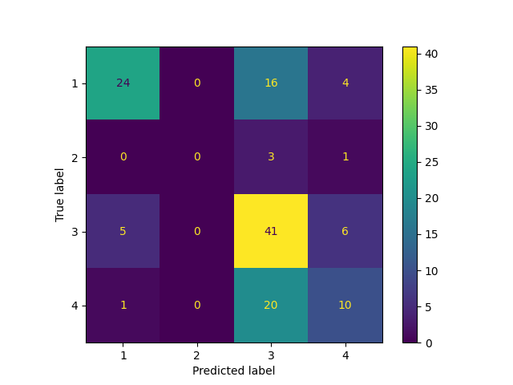

# Classification Report for K-Nearest Neighbors

## Parameter Search Results

|   rank_test_f1_weighted |   mean_test_f1_weighted |   mean_test_balanced_accuracy |   mean_fit_time | params                                    |
|------------------------:|------------------------:|------------------------------:|----------------:|:------------------------------------------|
|                       1 |                0.585614 |                      0.454633 |      0.00439992 | {'kneighborsclassifier__n_neighbors': 11} |
|                       2 |                0.585363 |                      0.44216  |      0.00500607 | {'kneighborsclassifier__n_neighbors': 10} |
|                       3 |                0.582656 |                      0.442418 |      0.0044003  | {'kneighborsclassifier__n_neighbors': 8}  |
|                       4 |                0.577665 |                      0.435178 |      0.00440073 | {'kneighborsclassifier__n_neighbors': 9}  |
|                       5 |                0.569212 |                      0.429381 |      0.00479836 | {'kneighborsclassifier__n_neighbors': 12} |
|                       6 |                0.567693 |                      0.443663 |      0.00460038 | {'kneighborsclassifier__n_neighbors': 5}  |
|                       7 |                0.564968 |                      0.425769 |      0.00459976 | {'kneighborsclassifier__n_neighbors': 14} |
|                       8 |                0.564932 |                      0.42763  |      0.00440063 | {'kneighborsclassifier__n_neighbors': 7}  |
|                       9 |                0.562828 |                      0.423964 |      0.00559721 | {'kneighborsclassifier__n_neighbors': 13} |
|                      10 |                0.561133 |                      0.422535 |      0.00419989 | {'kneighborsclassifier__n_neighbors': 15} |
|                      11 |                0.560479 |                      0.427694 |      0.00559988 | {'kneighborsclassifier__n_neighbors': 4}  |
|                      12 |                0.559151 |                      0.423527 |      0.00500016 | {'kneighborsclassifier__n_neighbors': 1}  |
|                      13 |                0.557479 |                      0.424835 |      0.00460143 | {'kneighborsclassifier__n_neighbors': 6}  |
|                      14 |                0.551478 |                      0.414531 |      0.00480037 | {'kneighborsclassifier__n_neighbors': 16} |
|                      15 |                0.543034 |                      0.416379 |      0.00459962 | {'kneighborsclassifier__n_neighbors': 3}  |
|                      16 |                0.540476 |                      0.406509 |      0.0046011  | {'kneighborsclassifier__n_neighbors': 17} |
|                      17 |                0.539228 |                      0.404996 |      0.0056005  | {'kneighborsclassifier__n_neighbors': 18} |
|                      18 |                0.530326 |                      0.402181 |      0.00499911 | {'kneighborsclassifier__n_neighbors': 2}  |
|                      19 |                0.526819 |                      0.395329 |      0.00459905 | {'kneighborsclassifier__n_neighbors': 24} |
|                      20 |                0.525323 |                      0.394785 |      0.00500093 | {'kneighborsclassifier__n_neighbors': 19} |
|                      21 |                0.519114 |                      0.391186 |      0.00500045 | {'kneighborsclassifier__n_neighbors': 20} |
|                      22 |                0.515279 |                      0.387851 |      0.00539985 | {'kneighborsclassifier__n_neighbors': 23} |
|                      23 |                0.514588 |                      0.386384 |      0.00480103 | {'kneighborsclassifier__n_neighbors': 22} |
|                      24 |                0.514559 |                      0.387376 |      0.00460005 | {'kneighborsclassifier__n_neighbors': 28} |
|                      25 |                0.513875 |                      0.386493 |      0.00460091 | {'kneighborsclassifier__n_neighbors': 21} |
|                      26 |                0.513865 |                      0.386522 |      0.00399842 | {'kneighborsclassifier__n_neighbors': 25} |
|                      27 |                0.503347 |                      0.379683 |      0.00500154 | {'kneighborsclassifier__n_neighbors': 29} |
|                      28 |                0.502904 |                      0.380295 |      0.00499959 | {'kneighborsclassifier__n_neighbors': 31} |
|                      29 |                0.502844 |                      0.380245 |      0.00420117 | {'kneighborsclassifier__n_neighbors': 30} |
|                      30 |                0.500115 |                      0.377665 |      0.00460057 | {'kneighborsclassifier__n_neighbors': 26} |
|                      31 |                0.495838 |                      0.375197 |      0.00440121 | {'kneighborsclassifier__n_neighbors': 27} |
|                      32 |                0.493222 |                      0.375448 |      0.00499988 | {'kneighborsclassifier__n_neighbors': 32} |
|                      33 |                0.492442 |                      0.377198 |      0.00479965 | {'kneighborsclassifier__n_neighbors': 34} |
|                      34 |                0.491955 |                      0.374593 |      0.00619965 | {'kneighborsclassifier__n_neighbors': 33} |
|                      35 |                0.485914 |                      0.37368  |      0.00480084 | {'kneighborsclassifier__n_neighbors': 46} |
|                      36 |                0.485802 |                      0.372808 |      0.00440021 | {'kneighborsclassifier__n_neighbors': 35} |
|                      37 |                0.482028 |                      0.371049 |      0.00419888 | {'kneighborsclassifier__n_neighbors': 47} |
|                      38 |                0.479651 |                      0.37003  |      0.00480008 | {'kneighborsclassifier__n_neighbors': 38} |
|                      39 |                0.478925 |                      0.369011 |      0.00479908 | {'kneighborsclassifier__n_neighbors': 36} |
|                      40 |                0.478758 |                      0.369126 |      0.00419955 | {'kneighborsclassifier__n_neighbors': 45} |
|                      41 |                0.476211 |                      0.366494 |      0.00500002 | {'kneighborsclassifier__n_neighbors': 37} |
|                      42 |                0.476039 |                      0.366855 |      0.00460005 | {'kneighborsclassifier__n_neighbors': 44} |
|                      43 |                0.472479 |                      0.364931 |      0.00499978 | {'kneighborsclassifier__n_neighbors': 49} |
|                      43 |                0.472479 |                      0.364931 |      0.0049994  | {'kneighborsclassifier__n_neighbors': 48} |
|                      45 |                0.471234 |                      0.365165 |      0.00519953 | {'kneighborsclassifier__n_neighbors': 39} |
|                      46 |                0.470695 |                      0.366632 |      0.00499992 | {'kneighborsclassifier__n_neighbors': 42} |
|                      47 |                0.47002  |                      0.363716 |      0.00419931 | {'kneighborsclassifier__n_neighbors': 43} |
|                      48 |                0.466117 |                      0.361483 |      0.00459895 | {'kneighborsclassifier__n_neighbors': 54} |
|                      49 |                0.465394 |                      0.360415 |      0.0047996  | {'kneighborsclassifier__n_neighbors': 55} |
|                      50 |                0.464921 |                      0.363836 |      0.0041995  | {'kneighborsclassifier__n_neighbors': 40} |
|                      51 |                0.462023 |                      0.360464 |      0.0044013  | {'kneighborsclassifier__n_neighbors': 41} |
|                      52 |                0.460689 |                      0.357637 |      0.00440054 | {'kneighborsclassifier__n_neighbors': 53} |
|                      53 |                0.460118 |                      0.357637 |      0.0054008  | {'kneighborsclassifier__n_neighbors': 52} |
|                      54 |                0.45975  |                      0.356334 |      0.00420027 | {'kneighborsclassifier__n_neighbors': 51} |
|                      55 |                0.459073 |                      0.359592 |      0.00459895 | {'kneighborsclassifier__n_neighbors': 59} |
|                      56 |                0.456055 |                      0.353753 |      0.00420065 | {'kneighborsclassifier__n_neighbors': 50} |
|                      57 |                0.455885 |                      0.357523 |      0.00459991 | {'kneighborsclassifier__n_neighbors': 71} |
|                      58 |                0.455545 |                      0.358427 |      0.00459938 | {'kneighborsclassifier__n_neighbors': 60} |
|                      59 |                0.455394 |                      0.357523 |      0.00579996 | {'kneighborsclassifier__n_neighbors': 56} |
|                      60 |                0.455321 |                      0.357523 |      0.00740094 | {'kneighborsclassifier__n_neighbors': 76} |
|                      61 |                0.455267 |                      0.358427 |      0.00519977 | {'kneighborsclassifier__n_neighbors': 58} |
|                      62 |                0.453727 |                      0.356504 |      0.00480018 | {'kneighborsclassifier__n_neighbors': 57} |
|                      63 |                0.453419 |                      0.355599 |      0.00620117 | {'kneighborsclassifier__n_neighbors': 74} |
|                      64 |                0.453335 |                      0.359615 |      0.00420051 | {'kneighborsclassifier__n_neighbors': 79} |
|                      65 |                0.453291 |                      0.355599 |      0.00479898 | {'kneighborsclassifier__n_neighbors': 73} |
|                      66 |                0.45293  |                      0.355599 |      0.00520005 | {'kneighborsclassifier__n_neighbors': 72} |
|                      67 |                0.452852 |                      0.359615 |      0.00479746 | {'kneighborsclassifier__n_neighbors': 77} |
|                      68 |                0.45246  |                      0.357098 |      0.00499921 | {'kneighborsclassifier__n_neighbors': 63} |
|                      69 |                0.4523   |                      0.359615 |      0.00459995 | {'kneighborsclassifier__n_neighbors': 78} |
|                      70 |                0.451593 |                      0.354891 |      0.0045989  | {'kneighborsclassifier__n_neighbors': 61} |
|                      71 |                0.449948 |                      0.355485 |      0.00499969 | {'kneighborsclassifier__n_neighbors': 75} |
|                      72 |                0.448439 |                      0.356079 |      0.00480075 | {'kneighborsclassifier__n_neighbors': 64} |
|                      73 |                0.448285 |                      0.356079 |      0.00559964 | {'kneighborsclassifier__n_neighbors': 80} |
|                      74 |                0.448188 |                      0.356079 |      0.00500007 | {'kneighborsclassifier__n_neighbors': 82} |
|                      75 |                0.447881 |                      0.356079 |      0.00479994 | {'kneighborsclassifier__n_neighbors': 70} |
|                      75 |                0.447881 |                      0.356079 |      0.0048008  | {'kneighborsclassifier__n_neighbors': 65} |
|                      75 |                0.447881 |                      0.356079 |      0.00500035 | {'kneighborsclassifier__n_neighbors': 62} |
|                      75 |                0.447881 |                      0.356079 |      0.00659981 | {'kneighborsclassifier__n_neighbors': 69} |
|                      79 |                0.447507 |                      0.355769 |      0.00460052 | {'kneighborsclassifier__n_neighbors': 81} |
|                      80 |                0.44641  |                      0.354467 |      0.00479984 | {'kneighborsclassifier__n_neighbors': 66} |
|                      81 |                0.445859 |                      0.354467 |      0.0054009  | {'kneighborsclassifier__n_neighbors': 68} |
|                      82 |                0.444663 |                      0.352854 |      0.00460076 | {'kneighborsclassifier__n_neighbors': 67} |
|                      83 |                0.444397 |                      0.353846 |      0.00500002 | {'kneighborsclassifier__n_neighbors': 85} |
|                      84 |                0.442386 |                      0.352233 |      0.00440021 | {'kneighborsclassifier__n_neighbors': 83} |
|                      84 |                0.442386 |                      0.352233 |      0.0049993  | {'kneighborsclassifier__n_neighbors': 84} |
|                      86 |                0.441439 |                      0.351923 |      0.00479941 | {'kneighborsclassifier__n_neighbors': 86} |
|                      87 |                0.441075 |                      0.351923 |      0.0046     | {'kneighborsclassifier__n_neighbors': 88} |
|                      88 |                0.437644 |                      0.35     |      0.00540004 | {'kneighborsclassifier__n_neighbors': 87} |
|                      89 |                0.435096 |                      0.348077 |      0.0047996  | {'kneighborsclassifier__n_neighbors': 89} |
|                      89 |                0.435096 |                      0.348077 |      0.00560093 | {'kneighborsclassifier__n_neighbors': 90} |
|                      91 |                0.43289  |                      0.346464 |      0.00459938 | {'kneighborsclassifier__n_neighbors': 91} |
|                      92 |                0.432725 |                      0.346154 |      0.00459967 | {'kneighborsclassifier__n_neighbors': 95} |
|                      93 |                0.432344 |                      0.346154 |      0.00479922 | {'kneighborsclassifier__n_neighbors': 97} |
|                      94 |                0.427742 |                      0.342928 |      0.00460114 | {'kneighborsclassifier__n_neighbors': 92} |
|                      95 |                0.426514 |                      0.342618 |      0.00440097 | {'kneighborsclassifier__n_neighbors': 94} |
|                      96 |                0.424659 |                      0.341005 |      0.00479946 | {'kneighborsclassifier__n_neighbors': 93} |
|                      97 |                0.422855 |                      0.340385 |      0.00559902 | {'kneighborsclassifier__n_neighbors': 96} |
|                      98 |                0.42103  |                      0.338772 |      0.00459986 | {'kneighborsclassifier__n_neighbors': 99} |
|                      99 |                0.418046 |                      0.336849 |      0.00479932 | {'kneighborsclassifier__n_neighbors': 98} |
|                     100 |              nan        |                    nan        |      0.00479817 | {'kneighborsclassifier__n_neighbors': 0}  |

## Best Classifier Found

```
Pipeline(steps=[('standardscaler', StandardScaler()),
                ('kneighborsclassifier', KNeighborsClassifier(n_neighbors=11))])
{'kneighborsclassifier__n_neighbors': 11}
```

### Training report

```
              precision    recall  f1-score   support

           1       0.82      0.58      0.68       130
           2       0.00      0.00      0.00        14
           3       0.58      0.88      0.70       156
           4       0.66      0.43      0.52        92

    accuracy                           0.65       392
   macro avg       0.51      0.47      0.48       392
weighted avg       0.66      0.65      0.63       392
```

### Testing report

```
              precision    recall  f1-score   support

           1       0.80      0.55      0.65        44
           2       0.00      0.00      0.00         4
           3       0.51      0.79      0.62        52
           4       0.48      0.32      0.38        31

    accuracy                           0.57       131
   macro avg       0.45      0.41      0.41       131
weighted avg       0.58      0.57      0.56       131
```
### Confusion matrix



