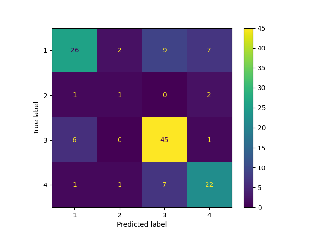

# Classification Report for Logistic Regression

## Parameter Search Results

|   rank_test_f1_weighted |   mean_test_f1_weighted |   mean_test_balanced_accuracy |   mean_fit_time | params                                           |
|------------------------:|------------------------:|------------------------------:|----------------:|:-------------------------------------------------|
|                       1 |                0.685409 |                      0.609463 |       0.0452001 | {'logisticregression__C': 302.34514136199306}    |
|                       2 |                0.685028 |                      0.610015 |       0.0443999 | {'logisticregression__C': 229.13121388330973}    |
|                       3 |                0.683349 |                      0.608453 |       0.0476    | {'logisticregression__C': 125.76202741082203}    |
|                       4 |                0.683191 |                      0.607744 |       0.0333994 | {'logisticregression__C': 104.65074136573224}    |
|                       5 |                0.680474 |                      0.605365 |       0.0468008 | {'logisticregression__C': 27.868399582322166}    |
|                       6 |                0.680144 |                      0.602821 |       0.0437997 | {'logisticregression__C': 24.221528752331896}    |
|                       7 |                0.6799   |                      0.603131 |       0.0467992 | {'logisticregression__C': 19.944516649904912}    |
|                       8 |                0.679713 |                      0.602985 |       0.0452002 | {'logisticregression__C': 9.041473358639108}     |
|                       9 |                0.678695 |                      0.573275 |       0.0436001 | {'logisticregression__C': 4.44794862206177}      |
|                      10 |                0.678491 |                      0.603702 |       0.0481996 | {'logisticregression__C': 37.75868729126436}     |
|                      11 |                0.677948 |                      0.602847 |       0.0454002 | {'logisticregression__C': 33.019094705700596}    |
|                      12 |                0.677822 |                      0.604158 |       0.0438017 | {'logisticregression__C': 94.95015587564623}     |
|                      13 |                0.677813 |                      0.602751 |       0.0441993 | {'logisticregression__C': 80.03233597846814}     |
|                      14 |                0.677787 |                      0.602897 |       0.0468001 | {'logisticregression__C': 127.36052220779301}    |
|                      15 |                0.677528 |                      0.602537 |       0.0460002 | {'logisticregression__C': 23.161602770992264}    |
|                      16 |                0.676426 |                      0.602646 |       0.0468026 | {'logisticregression__C': 668.9071236457701}     |
|                      17 |                0.676388 |                      0.570983 |       0.0446009 | {'logisticregression__C': 1.5046275610329227}    |
|                      18 |                0.676381 |                      0.57237  |       0.0435994 | {'logisticregression__C': 6.819856711517047}     |
|                      19 |                0.67605  |                      0.571662 |       0.045601  | {'logisticregression__C': 4.7375000508561245}    |
|                      20 |                0.675974 |                      0.601779 |       0.0467989 | {'logisticregression__C': 35.16223351975738}     |
|                      21 |                0.675945 |                      0.571662 |       0.0437994 | {'logisticregression__C': 6.169166083486794}     |
|                      22 |                0.675911 |                      0.602797 |       0.0428014 | {'logisticregression__C': 108.34780181186812}    |
|                      23 |                0.675556 |                      0.571352 |       0.0439997 | {'logisticregression__C': 5.958561016673374}     |
|                      24 |                0.675541 |                      0.60076  |       0.0434007 | {'logisticregression__C': 299.240348840311}      |
|                      25 |                0.674922 |                      0.600215 |       0.0475998 | {'logisticregression__C': 68.26923124859454}     |
|                      26 |                0.674835 |                      0.599461 |       0.0456001 | {'logisticregression__C': 78.92169302730673}     |
|                      27 |                0.673704 |                      0.56906  |       0.0438002 | {'logisticregression__C': 1.1623465856792417}    |
|                      27 |                0.673704 |                      0.56906  |       0.0457965 | {'logisticregression__C': 1.3781068286928708}    |
|                      29 |                0.673702 |                      0.598557 |       0.0454    | {'logisticregression__C': 253.1833625307774}     |
|                      30 |                0.673627 |                      0.584705 |       0.0472002 | {'logisticregression__C': 9.872336908334013}     |
|                      31 |                0.673525 |                      0.569739 |       0.0429998 | {'logisticregression__C': 5.413312790676953}     |
|                      32 |                0.673296 |                      0.56903  |       0.0463995 | {'logisticregression__C': 5.825013684357164}     |
|                      33 |                0.673185 |                      0.60128  |       0.0474003 | {'logisticregression__C': 852.6764463487576}     |
|                      34 |                0.672931 |                      0.599097 |       0.0431993 | {'logisticregression__C': 91.38756600560433}     |
|                      35 |                0.672887 |                      0.600216 |       0.0464004 | {'logisticregression__C': 545.0440736385902}     |
|                      36 |                0.672885 |                      0.599964 |       0.0448    | {'logisticregression__C': 123.88920006540833}    |
|                      37 |                0.672793 |                      0.598507 |       0.0464    | {'logisticregression__C': 357.53119069190774}    |
|                      38 |                0.672733 |                      0.598703 |       0.0447998 | {'logisticregression__C': 73.21012736393963}     |
|                      39 |                0.672516 |                      0.598196 |       0.0453998 | {'logisticregression__C': 184.05974813799796}    |
|                      40 |                0.672021 |                      0.597342 |       0.0440021 | {'logisticregression__C': 38.48910429886624}     |
|                      41 |                0.671871 |                      0.568067 |       0.0451995 | {'logisticregression__C': 2.0695101967161356}    |
|                      42 |                0.67151  |                      0.598515 |       0.0445998 | {'logisticregression__C': 376.48399288352294}    |
|                      43 |                0.671405 |                      0.59709  |       0.0441999 | {'logisticregression__C': 336.8671623382661}     |
|                      44 |                0.670962 |                      0.598419 |       0.0504004 | {'logisticregression__C': 510.511070600498}      |
|                      45 |                0.670931 |                      0.589359 |       0.0468008 | {'logisticregression__C': 0.9589589518376185}    |
|                      46 |                0.670683 |                      0.598059 |       0.0448013 | {'logisticregression__C': 405.33246165324505}    |
|                      47 |                0.670644 |                      0.598603 |       0.0457994 | {'logisticregression__C': 150.90560636186984}    |
|                      48 |                0.6705   |                      0.589049 |       0.0453995 | {'logisticregression__C': 0.8868694385698876}    |
|                      48 |                0.6705   |                      0.589049 |       0.0534019 | {'logisticregression__C': 0.7900768432139639}    |
|                      50 |                0.670422 |                      0.598059 |       0.0435995 | {'logisticregression__C': 565.6538771171039}     |
|                      51 |                0.670418 |                      0.565942 |       0.0477995 | {'logisticregression__C': 3.728170751169189}     |
|                      52 |                0.670237 |                      0.56702  |       0.0428001 | {'logisticregression__C': 11.709794631332183}    |
|                      53 |                0.668337 |                      0.596592 |       0.0449983 | {'logisticregression__C': 895.757207235046}      |
|                      54 |                0.66831  |                      0.565494 |       0.0444004 | {'logisticregression__C': 6.564318945363618}     |
|                      55 |                0.668271 |                      0.587436 |       0.0430003 | {'logisticregression__C': 0.9423003969915811}    |
|                      56 |                0.66718  |                      0.564582 |       0.0458003 | {'logisticregression__C': 2.011160408766648}     |
|                      57 |                0.666475 |                      0.564221 |       0.0440004 | {'logisticregression__C': 2.0534881795684004}    |
|                      58 |                0.652457 |                      0.54922  |       0.0438011 | {'logisticregression__C': 0.3751848558634359}    |
|                      59 |                0.651985 |                      0.54891  |       0.0392001 | {'logisticregression__C': 0.29286163912179636}   |
|                      60 |                0.651008 |                      0.534304 |       0.0363996 | {'logisticregression__C': 0.2525455002358625}    |
|                      61 |                0.645869 |                      0.528584 |       0.0359998 | {'logisticregression__C': 0.19735028763187837}   |
|                      62 |                0.64344  |                      0.525806 |       0.0323997 | {'logisticregression__C': 0.16863481121300802}   |
|                      63 |                0.642978 |                      0.526661 |       0.0336005 | {'logisticregression__C': 0.20377671105070438}   |
|                      63 |                0.642978 |                      0.526661 |       0.0353987 | {'logisticregression__C': 0.20209205751195802}   |
|                      65 |                0.636634 |                      0.506362 |       0.0323991 | {'logisticregression__C': 0.16571597276401365}   |
|                      66 |                0.605182 |                      0.478574 |       0.0295991 | {'logisticregression__C': 0.11531680843217926}   |
|                      66 |                0.605182 |                      0.478574 |       0.029599  | {'logisticregression__C': 0.11773050252007132}   |
|                      68 |                0.603077 |                      0.476961 |       0.0290004 | {'logisticregression__C': 0.1048057450361974}    |
|                      69 |                0.58343  |                      0.461588 |       0.0255993 | {'logisticregression__C': 0.0750904771583532}    |
|                      70 |                0.550653 |                      0.440147 |       0.0242001 | {'logisticregression__C': 0.032099234156705535}  |
|                      71 |                0.545885 |                      0.436611 |       0.0243998 | {'logisticregression__C': 0.02946205841873604}   |
|                      72 |                0.545436 |                      0.436611 |       0.0243999 | {'logisticregression__C': 0.042686634292079965}  |
|                      73 |                0.542531 |                      0.434688 |       0.026399  | {'logisticregression__C': 0.04680247908722853}   |
|                      74 |                0.528695 |                      0.424577 |       0.022     | {'logisticregression__C': 0.023658040408548478}  |
|                      75 |                0.490395 |                      0.40263  |       0.0239975 | {'logisticregression__C': 0.01679000068104958}   |
|                      75 |                0.490395 |                      0.40263  |       0.0195987 | {'logisticregression__C': 0.01713175576299231}   |
|                      77 |                0.485782 |                      0.399852 |       0.0211998 | {'logisticregression__C': 0.013862901905494145}  |
|                      77 |                0.485782 |                      0.399852 |       0.0195993 | {'logisticregression__C': 0.013638510040717425}  |
|                      79 |                0.485478 |                      0.399852 |       0.0198    | {'logisticregression__C': 0.016128334223945287}  |
|                      79 |                0.485478 |                      0.399852 |       0.0195998 | {'logisticregression__C': 0.015102744271253783}  |
|                      81 |                0.468771 |                      0.367519 |       0.0201998 | {'logisticregression__C': 0.01105056345384686}   |
|                      82 |                0.465792 |                      0.365596 |       0.0191991 | {'logisticregression__C': 0.010495508697561353}  |
|                      83 |                0.460747 |                      0.362965 |       0.0211998 | {'logisticregression__C': 0.008202368973238266}  |
|                      83 |                0.460747 |                      0.362965 |       0.0192    | {'logisticregression__C': 0.008796822074600204}  |
|                      85 |                0.460524 |                      0.362965 |       0.0189998 | {'logisticregression__C': 0.009223211812817142}  |
|                      86 |                0.455792 |                      0.360187 |       0.0183996 | {'logisticregression__C': 0.006402466667907735}  |
|                      87 |                0.455401 |                      0.360187 |       0.0187991 | {'logisticregression__C': 0.00698678327060683}   |
|                      87 |                0.455401 |                      0.360187 |       0.0194002 | {'logisticregression__C': 0.007132935604794899}  |
|                      89 |                0.454044 |                      0.360325 |       0.0182    | {'logisticregression__C': 0.0023433790717446897} |
|                      89 |                0.454044 |                      0.360325 |       0.0191996 | {'logisticregression__C': 0.002300305395526384}  |
|                      91 |                0.453841 |                      0.360325 |       0.0184001 | {'logisticregression__C': 0.00310856704510865}   |
|                      91 |                0.453841 |                      0.360325 |       0.0179997 | {'logisticregression__C': 0.003018410082530198}  |
|                      91 |                0.453841 |                      0.360325 |       0.0185994 | {'logisticregression__C': 0.0029356169334471545} |
|                      94 |                0.452337 |                      0.359022 |       0.0198    | {'logisticregression__C': 0.0040000793716156325} |
|                      94 |                0.452337 |                      0.359022 |       0.0169997 | {'logisticregression__C': 0.004046173396976438}  |
|                      94 |                0.452337 |                      0.359022 |       0.0184    | {'logisticregression__C': 0.004255095457697121}  |
|                      97 |                0.451894 |                      0.358762 |       0.0192011 | {'logisticregression__C': 0.0013245999205607926} |
|                      97 |                0.451894 |                      0.358762 |       0.0191992 | {'logisticregression__C': 0.0014319643307939575} |
|                      97 |                0.451894 |                      0.358762 |       0.0171995 | {'logisticregression__C': 0.001750943033713387}  |
|                     100 |                0.451399 |                      0.358762 |       0.0171995 | {'logisticregression__C': 0.0012838899927022905} |

## Best Classifier Found

```
Pipeline(steps=[('standardscaler', StandardScaler()),
                ('logisticregression',
                 LogisticRegression(C=302.34514136199306))])
{'logisticregression__C': 302.34514136199306}
```

### Training report

```
              precision    recall  f1-score   support

           1       0.79      0.62      0.69       130
           2       0.60      0.43      0.50        14
           3       0.68      0.88      0.77       156
           4       0.78      0.67      0.72        92

    accuracy                           0.73       392
   macro avg       0.71      0.65      0.67       392
weighted avg       0.74      0.73      0.72       392
```

### Testing report

```
              precision    recall  f1-score   support

           1       0.76      0.59      0.67        44
           2       0.25      0.25      0.25         4
           3       0.74      0.87      0.80        52
           4       0.69      0.71      0.70        31

    accuracy                           0.72       131
   macro avg       0.61      0.60      0.60       131
weighted avg       0.72      0.72      0.71       131
```
### Confusion matrix



