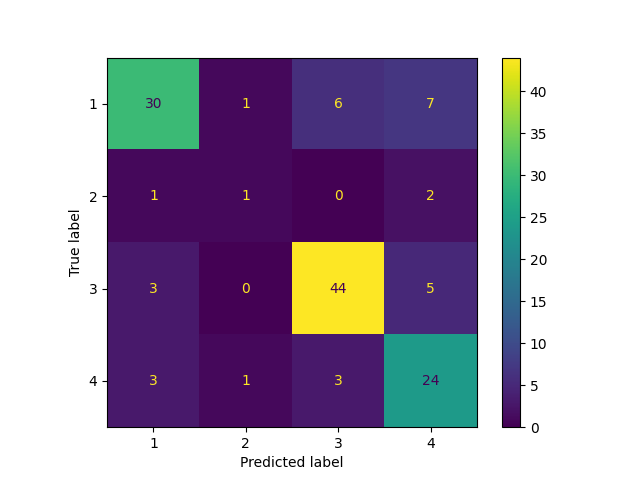

# Classification Report for Multi-layer Perceptron

## Parameter Search Results

|   rank_test_f1_weighted |   mean_test_f1_weighted |   mean_test_balanced_accuracy |   mean_fit_time | params                                                                                                                                         |
|------------------------:|------------------------:|------------------------------:|----------------:|:-----------------------------------------------------------------------------------------------------------------------------------------------|
|                       1 |                0.719908 |                      0.624777 |        1.777    | {'mlpclassifier__learning_rate': 'constant', 'mlpclassifier__hidden_layer_sizes': (200, 200), 'mlpclassifier__activation': 'relu'}             |
|                       2 |                0.714445 |                      0.630214 |        1.79681  | {'mlpclassifier__learning_rate': 'invscaling', 'mlpclassifier__hidden_layer_sizes': (200, 200), 'mlpclassifier__activation': 'relu'}           |
|                       3 |                0.707415 |                      0.591453 |        0.768402 | {'mlpclassifier__learning_rate': 'invscaling', 'mlpclassifier__hidden_layer_sizes': (50, 50, 50, 50), 'mlpclassifier__activation': 'relu'}     |
|                       4 |                0.705993 |                      0.631187 |        2.898    | {'mlpclassifier__learning_rate': 'invscaling', 'mlpclassifier__hidden_layer_sizes': (200, 200, 200), 'mlpclassifier__activation': 'tanh'}      |
|                       5 |                0.704418 |                      0.638033 |        0.736402 | {'mlpclassifier__learning_rate': 'adaptive', 'mlpclassifier__hidden_layer_sizes': (50, 50, 50, 50), 'mlpclassifier__activation': 'relu'}       |
|                       6 |                0.700008 |                      0.597489 |        0.786799 | {'mlpclassifier__learning_rate': 'invscaling', 'mlpclassifier__hidden_layer_sizes': (50, 50, 50, 50), 'mlpclassifier__activation': 'tanh'}     |
|                       7 |                0.699062 |                      0.621131 |        0.8136   | {'mlpclassifier__learning_rate': 'adaptive', 'mlpclassifier__hidden_layer_sizes': (50, 50, 50, 50), 'mlpclassifier__activation': 'tanh'}       |
|                       8 |                0.698924 |                      0.584095 |        1.0832   | {'mlpclassifier__learning_rate': 'invscaling', 'mlpclassifier__hidden_layer_sizes': (100, 100, 100), 'mlpclassifier__activation': 'relu'}      |
|                       9 |                0.69768  |                      0.621174 |        0.837601 | {'mlpclassifier__learning_rate': 'invscaling', 'mlpclassifier__hidden_layer_sizes': (100, 100), 'mlpclassifier__activation': 'relu'}           |
|                      10 |                0.696844 |                      0.606274 |        1.55699  | {'mlpclassifier__learning_rate': 'adaptive', 'mlpclassifier__hidden_layer_sizes': (200, 200), 'mlpclassifier__activation': 'relu'}             |
|                      11 |                0.696583 |                      0.607997 |        1.1512   | {'mlpclassifier__learning_rate': 'constant', 'mlpclassifier__hidden_layer_sizes': (100, 100, 100), 'mlpclassifier__activation': 'tanh'}        |
|                      12 |                0.69658  |                      0.597259 |        0.757203 | {'mlpclassifier__learning_rate': 'constant', 'mlpclassifier__hidden_layer_sizes': (50, 50, 50, 50), 'mlpclassifier__activation': 'relu'}       |
|                      13 |                0.694188 |                      0.571518 |        2.8518   | {'mlpclassifier__learning_rate': 'adaptive', 'mlpclassifier__hidden_layer_sizes': (200, 200, 200), 'mlpclassifier__activation': 'relu'}        |
|                      14 |                0.693293 |                      0.620153 |        1.0774   | {'mlpclassifier__learning_rate': 'constant', 'mlpclassifier__hidden_layer_sizes': (100, 100, 100), 'mlpclassifier__activation': 'relu'}        |
|                      15 |                0.692546 |                      0.575148 |        0.586599 | {'mlpclassifier__learning_rate': 'invscaling', 'mlpclassifier__hidden_layer_sizes': (50, 50, 50), 'mlpclassifier__activation': 'relu'}         |
|                      16 |                0.690502 |                      0.602265 |        2.5804   | {'mlpclassifier__learning_rate': 'constant', 'mlpclassifier__hidden_layer_sizes': (200, 200, 200), 'mlpclassifier__activation': 'relu'}        |
|                      17 |                0.689697 |                      0.575732 |        0.649003 | {'mlpclassifier__learning_rate': 'adaptive', 'mlpclassifier__hidden_layer_sizes': (50, 50, 50), 'mlpclassifier__activation': 'tanh'}           |
|                      18 |                0.688487 |                      0.611538 |        0.466402 | {'mlpclassifier__learning_rate': 'adaptive', 'mlpclassifier__hidden_layer_sizes': (50, 50), 'mlpclassifier__activation': 'tanh'}               |
|                      19 |                0.687607 |                      0.590028 |        1.4836   | {'mlpclassifier__learning_rate': 'adaptive', 'mlpclassifier__hidden_layer_sizes': (200, 200), 'mlpclassifier__activation': 'tanh'}             |
|                      20 |                0.686227 |                      0.598285 |        0.612401 | {'mlpclassifier__learning_rate': 'adaptive', 'mlpclassifier__hidden_layer_sizes': (50, 50, 50), 'mlpclassifier__activation': 'relu'}           |
|                      21 |                0.686038 |                      0.588165 |        0.824405 | {'mlpclassifier__learning_rate': 'adaptive', 'mlpclassifier__hidden_layer_sizes': (100, 100), 'mlpclassifier__activation': 'tanh'}             |
|                      22 |                0.684075 |                      0.600951 |        0.831798 | {'mlpclassifier__learning_rate': 'constant', 'mlpclassifier__hidden_layer_sizes': (50, 50, 50, 50), 'mlpclassifier__activation': 'tanh'}       |
|                      23 |                0.682772 |                      0.57231  |        1.7636   | {'mlpclassifier__learning_rate': 'invscaling', 'mlpclassifier__hidden_layer_sizes': (200, 200), 'mlpclassifier__activation': 'tanh'}           |
|                      24 |                0.68273  |                      0.584262 |        1.199    | {'mlpclassifier__learning_rate': 'adaptive', 'mlpclassifier__hidden_layer_sizes': (100, 100, 100), 'mlpclassifier__activation': 'tanh'}        |
|                      25 |                0.682672 |                      0.56733  |        0.8008   | {'mlpclassifier__learning_rate': 'constant', 'mlpclassifier__hidden_layer_sizes': (100, 100), 'mlpclassifier__activation': 'tanh'}             |
|                      26 |                0.682111 |                      0.603713 |        0.759805 | {'mlpclassifier__learning_rate': 'adaptive', 'mlpclassifier__hidden_layer_sizes': (100, 100), 'mlpclassifier__activation': 'relu'}             |
|                      27 |                0.681926 |                      0.587871 |        1.15     | {'mlpclassifier__learning_rate': 'invscaling', 'mlpclassifier__hidden_layer_sizes': (100, 100, 100), 'mlpclassifier__activation': 'tanh'}      |
|                      28 |                0.68151  |                      0.609079 |        2.58199  | {'mlpclassifier__learning_rate': 'adaptive', 'mlpclassifier__hidden_layer_sizes': (200, 200, 200), 'mlpclassifier__activation': 'tanh'}        |
|                      29 |                0.680948 |                      0.573324 |        1.10621  | {'mlpclassifier__learning_rate': 'adaptive', 'mlpclassifier__hidden_layer_sizes': (100, 100, 100), 'mlpclassifier__activation': 'relu'}        |
|                      30 |                0.680544 |                      0.585415 |        0.769201 | {'mlpclassifier__learning_rate': 'constant', 'mlpclassifier__hidden_layer_sizes': (100, 100), 'mlpclassifier__activation': 'relu'}             |
|                      31 |                0.678714 |                      0.579402 |        0.675002 | {'mlpclassifier__learning_rate': 'constant', 'mlpclassifier__hidden_layer_sizes': (200,), 'mlpclassifier__activation': 'tanh'}                 |
|                      32 |                0.678513 |                      0.590266 |        0.485398 | {'mlpclassifier__learning_rate': 'constant', 'mlpclassifier__hidden_layer_sizes': (50, 50), 'mlpclassifier__activation': 'tanh'}               |
|                      33 |                0.678486 |                      0.576054 |        0.671198 | {'mlpclassifier__learning_rate': 'adaptive', 'mlpclassifier__hidden_layer_sizes': (200,), 'mlpclassifier__activation': 'tanh'}                 |
|                      34 |                0.678454 |                      0.598548 |        0.360998 | {'mlpclassifier__learning_rate': 'adaptive', 'mlpclassifier__hidden_layer_sizes': (50,), 'mlpclassifier__activation': 'tanh'}                  |
|                      35 |                0.678299 |                      0.59159  |        0.667197 | {'mlpclassifier__learning_rate': 'constant', 'mlpclassifier__hidden_layer_sizes': (50, 50, 50), 'mlpclassifier__activation': 'tanh'}           |
|                      36 |                0.678158 |                      0.575857 |        0.714999 | {'mlpclassifier__learning_rate': 'invscaling', 'mlpclassifier__hidden_layer_sizes': (200,), 'mlpclassifier__activation': 'tanh'}               |
|                      37 |                0.677799 |                      0.565747 |        0.469001 | {'mlpclassifier__learning_rate': 'invscaling', 'mlpclassifier__hidden_layer_sizes': (50, 50), 'mlpclassifier__activation': 'tanh'}             |
|                      38 |                0.677195 |                      0.600644 |        0.434002 | {'mlpclassifier__learning_rate': 'adaptive', 'mlpclassifier__hidden_layer_sizes': (100,), 'mlpclassifier__activation': 'tanh'}                 |
|                      39 |                0.677166 |                      0.591154 |        0.432999 | {'mlpclassifier__learning_rate': 'invscaling', 'mlpclassifier__hidden_layer_sizes': (50, 50), 'mlpclassifier__activation': 'relu'}             |
|                      40 |                0.67689  |                      0.567311 |        1.7626   | {'mlpclassifier__learning_rate': 'constant', 'mlpclassifier__hidden_layer_sizes': (200, 200), 'mlpclassifier__activation': 'tanh'}             |
|                      41 |                0.676226 |                      0.576689 |        0.450199 | {'mlpclassifier__learning_rate': 'constant', 'mlpclassifier__hidden_layer_sizes': (50, 50), 'mlpclassifier__activation': 'relu'}               |
|                      42 |                0.676058 |                      0.599055 |        0.3188   | {'mlpclassifier__learning_rate': 'constant', 'mlpclassifier__hidden_layer_sizes': (50,), 'mlpclassifier__activation': 'tanh'}                  |
|                      43 |                0.674962 |                      0.585028 |        0.379002 | {'mlpclassifier__learning_rate': 'constant', 'mlpclassifier__hidden_layer_sizes': (100,), 'mlpclassifier__activation': 'relu'}                 |
|                      44 |                0.674931 |                      0.573452 |        0.320401 | {'mlpclassifier__learning_rate': 'invscaling', 'mlpclassifier__hidden_layer_sizes': (50,), 'mlpclassifier__activation': 'tanh'}                |
|                      45 |                0.674513 |                      0.598721 |        0.419599 | {'mlpclassifier__learning_rate': 'constant', 'mlpclassifier__hidden_layer_sizes': (100,), 'mlpclassifier__activation': 'tanh'}                 |
|                      46 |                0.673368 |                      0.573449 |        0.797002 | {'mlpclassifier__learning_rate': 'invscaling', 'mlpclassifier__hidden_layer_sizes': (100, 100), 'mlpclassifier__activation': 'tanh'}           |
|                      47 |                0.672901 |                      0.557877 |        2.4204   | {'mlpclassifier__learning_rate': 'constant', 'mlpclassifier__hidden_layer_sizes': (200, 200, 200), 'mlpclassifier__activation': 'tanh'}        |
|                      48 |                0.669828 |                      0.581948 |        0.378401 | {'mlpclassifier__learning_rate': 'adaptive', 'mlpclassifier__hidden_layer_sizes': (100,), 'mlpclassifier__activation': 'relu'}                 |
|                      49 |                0.669738 |                      0.552128 |        0.298199 | {'mlpclassifier__learning_rate': 'adaptive', 'mlpclassifier__hidden_layer_sizes': (50,), 'mlpclassifier__activation': 'relu'}                  |
|                      50 |                0.669548 |                      0.56142  |        0.614599 | {'mlpclassifier__learning_rate': 'constant', 'mlpclassifier__hidden_layer_sizes': (50, 50, 50), 'mlpclassifier__activation': 'relu'}           |
|                      51 |                0.667748 |                      0.552296 |        0.297    | {'mlpclassifier__learning_rate': 'constant', 'mlpclassifier__hidden_layer_sizes': (50,), 'mlpclassifier__activation': 'relu'}                  |
|                      52 |                0.667385 |                      0.558069 |        0.635798 | {'mlpclassifier__learning_rate': 'invscaling', 'mlpclassifier__hidden_layer_sizes': (50, 50, 50), 'mlpclassifier__activation': 'tanh'}         |
|                      53 |                0.666931 |                      0.579221 |        0.5998   | {'mlpclassifier__learning_rate': 'invscaling', 'mlpclassifier__hidden_layer_sizes': (200,), 'mlpclassifier__activation': 'relu'}               |
|                      54 |                0.666203 |                      0.520935 |        3.4434   | {'mlpclassifier__learning_rate': 'constant', 'mlpclassifier__hidden_layer_sizes': (200, 200, 200), 'mlpclassifier__activation': 'logistic'}    |
|                      55 |                0.663931 |                      0.572605 |        2.9688   | {'mlpclassifier__learning_rate': 'invscaling', 'mlpclassifier__hidden_layer_sizes': (200, 200, 200), 'mlpclassifier__activation': 'relu'}      |
|                      56 |                0.66331  |                      0.556007 |        0.467002 | {'mlpclassifier__learning_rate': 'adaptive', 'mlpclassifier__hidden_layer_sizes': (50, 50), 'mlpclassifier__activation': 'relu'}               |
|                      57 |                0.663275 |                      0.517577 |        3.399    | {'mlpclassifier__learning_rate': 'invscaling', 'mlpclassifier__hidden_layer_sizes': (200, 200, 200), 'mlpclassifier__activation': 'logistic'}  |
|                      58 |                0.661641 |                      0.573317 |        0.392001 | {'mlpclassifier__learning_rate': 'invscaling', 'mlpclassifier__hidden_layer_sizes': (100,), 'mlpclassifier__activation': 'relu'}               |
|                      59 |                0.660814 |                      0.546925 |        0.3068   | {'mlpclassifier__learning_rate': 'invscaling', 'mlpclassifier__hidden_layer_sizes': (50,), 'mlpclassifier__activation': 'relu'}                |
|                      60 |                0.66024  |                      0.573938 |        0.5962   | {'mlpclassifier__learning_rate': 'constant', 'mlpclassifier__hidden_layer_sizes': (200,), 'mlpclassifier__activation': 'relu'}                 |
|                      61 |                0.660028 |                      0.511153 |        2.94139  | {'mlpclassifier__learning_rate': 'adaptive', 'mlpclassifier__hidden_layer_sizes': (200, 200, 200), 'mlpclassifier__activation': 'logistic'}    |
|                      62 |                0.658863 |                      0.564168 |        0.4338   | {'mlpclassifier__learning_rate': 'invscaling', 'mlpclassifier__hidden_layer_sizes': (100,), 'mlpclassifier__activation': 'tanh'}               |
|                      63 |                0.657858 |                      0.514621 |        1.80141  | {'mlpclassifier__learning_rate': 'constant', 'mlpclassifier__hidden_layer_sizes': (200, 200), 'mlpclassifier__activation': 'logistic'}         |
|                      64 |                0.655264 |                      0.571403 |        0.584599 | {'mlpclassifier__learning_rate': 'adaptive', 'mlpclassifier__hidden_layer_sizes': (200,), 'mlpclassifier__activation': 'relu'}                 |
|                      65 |                0.652173 |                      0.501464 |        0.767601 | {'mlpclassifier__learning_rate': 'constant', 'mlpclassifier__hidden_layer_sizes': (100, 100), 'mlpclassifier__activation': 'logistic'}         |
|                      66 |                0.651819 |                      0.507978 |        1.7238   | {'mlpclassifier__learning_rate': 'adaptive', 'mlpclassifier__hidden_layer_sizes': (200, 200), 'mlpclassifier__activation': 'logistic'}         |
|                      67 |                0.651434 |                      0.507376 |        1.83521  | {'mlpclassifier__learning_rate': 'invscaling', 'mlpclassifier__hidden_layer_sizes': (200, 200), 'mlpclassifier__activation': 'logistic'}       |
|                      68 |                0.642039 |                      0.49493  |        0.628201 | {'mlpclassifier__learning_rate': 'constant', 'mlpclassifier__hidden_layer_sizes': (200,), 'mlpclassifier__activation': 'logistic'}             |
|                      69 |                0.636423 |                      0.488886 |        0.769203 | {'mlpclassifier__learning_rate': 'invscaling', 'mlpclassifier__hidden_layer_sizes': (100, 100), 'mlpclassifier__activation': 'logistic'}       |
|                      70 |                0.635898 |                      0.488342 |        0.619599 | {'mlpclassifier__learning_rate': 'invscaling', 'mlpclassifier__hidden_layer_sizes': (200,), 'mlpclassifier__activation': 'logistic'}           |
|                      71 |                0.633063 |                      0.487748 |        0.631    | {'mlpclassifier__learning_rate': 'adaptive', 'mlpclassifier__hidden_layer_sizes': (200,), 'mlpclassifier__activation': 'logistic'}             |
|                      72 |                0.629636 |                      0.480493 |        0.803604 | {'mlpclassifier__learning_rate': 'adaptive', 'mlpclassifier__hidden_layer_sizes': (100, 100), 'mlpclassifier__activation': 'logistic'}         |
|                      73 |                0.626075 |                      0.478127 |        1.2628   | {'mlpclassifier__learning_rate': 'adaptive', 'mlpclassifier__hidden_layer_sizes': (100, 100, 100), 'mlpclassifier__activation': 'logistic'}    |
|                      74 |                0.614797 |                      0.469135 |        0.390399 | {'mlpclassifier__learning_rate': 'constant', 'mlpclassifier__hidden_layer_sizes': (100,), 'mlpclassifier__activation': 'logistic'}             |
|                      75 |                0.611331 |                      0.465402 |        0.394    | {'mlpclassifier__learning_rate': 'adaptive', 'mlpclassifier__hidden_layer_sizes': (100,), 'mlpclassifier__activation': 'logistic'}             |
|                      76 |                0.594515 |                      0.452719 |        0.3936   | {'mlpclassifier__learning_rate': 'invscaling', 'mlpclassifier__hidden_layer_sizes': (100,), 'mlpclassifier__activation': 'logistic'}           |
|                      77 |                0.589314 |                      0.44939  |        1.1382   | {'mlpclassifier__learning_rate': 'constant', 'mlpclassifier__hidden_layer_sizes': (100, 100, 100), 'mlpclassifier__activation': 'logistic'}    |
|                      78 |                0.581999 |                      0.440518 |        1.141    | {'mlpclassifier__learning_rate': 'invscaling', 'mlpclassifier__hidden_layer_sizes': (100, 100, 100), 'mlpclassifier__activation': 'logistic'}  |
|                      79 |                0.572331 |                      0.433224 |        0.283602 | {'mlpclassifier__learning_rate': 'invscaling', 'mlpclassifier__hidden_layer_sizes': (50,), 'mlpclassifier__activation': 'logistic'}            |
|                      80 |                0.56249  |                      0.425183 |        0.2868   | {'mlpclassifier__learning_rate': 'constant', 'mlpclassifier__hidden_layer_sizes': (50,), 'mlpclassifier__activation': 'logistic'}              |
|                      81 |                0.539627 |                      0.409664 |        0.288402 | {'mlpclassifier__learning_rate': 'adaptive', 'mlpclassifier__hidden_layer_sizes': (50,), 'mlpclassifier__activation': 'logistic'}              |
|                      82 |                0.526012 |                      0.402085 |        0.448599 | {'mlpclassifier__learning_rate': 'constant', 'mlpclassifier__hidden_layer_sizes': (50, 50), 'mlpclassifier__activation': 'logistic'}           |
|                      83 |                0.519485 |                      0.39646  |        0.450602 | {'mlpclassifier__learning_rate': 'adaptive', 'mlpclassifier__hidden_layer_sizes': (50, 50), 'mlpclassifier__activation': 'logistic'}           |
|                      84 |                0.518767 |                      0.394624 |        0.446201 | {'mlpclassifier__learning_rate': 'invscaling', 'mlpclassifier__hidden_layer_sizes': (50, 50), 'mlpclassifier__activation': 'logistic'}         |
|                      85 |                0.486998 |                      0.380415 |        0.639998 | {'mlpclassifier__learning_rate': 'invscaling', 'mlpclassifier__hidden_layer_sizes': (50, 50, 50), 'mlpclassifier__activation': 'logistic'}     |
|                      86 |                0.480474 |                      0.374586 |        0.631797 | {'mlpclassifier__learning_rate': 'constant', 'mlpclassifier__hidden_layer_sizes': (50, 50, 50), 'mlpclassifier__activation': 'logistic'}       |
|                      87 |                0.472712 |                      0.372395 |        0.864399 | {'mlpclassifier__learning_rate': 'constant', 'mlpclassifier__hidden_layer_sizes': (50, 50, 50, 50), 'mlpclassifier__activation': 'logistic'}   |
|                      88 |                0.472349 |                      0.372395 |        0.815999 | {'mlpclassifier__learning_rate': 'invscaling', 'mlpclassifier__hidden_layer_sizes': (50, 50, 50, 50), 'mlpclassifier__activation': 'logistic'} |
|                      89 |                0.471444 |                      0.369442 |        0.642602 | {'mlpclassifier__learning_rate': 'adaptive', 'mlpclassifier__hidden_layer_sizes': (50, 50, 50), 'mlpclassifier__activation': 'logistic'}       |
|                      90 |                0.417013 |                      0.343548 |        0.657999 | {'mlpclassifier__learning_rate': 'adaptive', 'mlpclassifier__hidden_layer_sizes': (50, 50, 50, 50), 'mlpclassifier__activation': 'logistic'}   |

## Best Classifier Found

```
Pipeline(steps=[('standardscaler', StandardScaler()),
                ('mlpclassifier',
                 MLPClassifier(hidden_layer_sizes=(200, 200)))])
{'mlpclassifier__learning_rate': 'constant', 'mlpclassifier__hidden_layer_sizes': (200, 200), 'mlpclassifier__activation': 'relu'}
```

### Training report

```
              precision    recall  f1-score   support

           1       0.94      0.78      0.85       130
           2       1.00      0.64      0.78        14
           3       0.80      0.97      0.88       156
           4       0.87      0.82      0.84        92

    accuracy                           0.86       392
   macro avg       0.90      0.80      0.84       392
weighted avg       0.87      0.86      0.86       392
```

### Testing report

```
              precision    recall  f1-score   support

           1       0.81      0.68      0.74        44
           2       0.33      0.25      0.29         4
           3       0.83      0.85      0.84        52
           4       0.63      0.77      0.70        31

    accuracy                           0.76       131
   macro avg       0.65      0.64      0.64       131
weighted avg       0.76      0.76      0.75       131
```
### Confusion matrix



