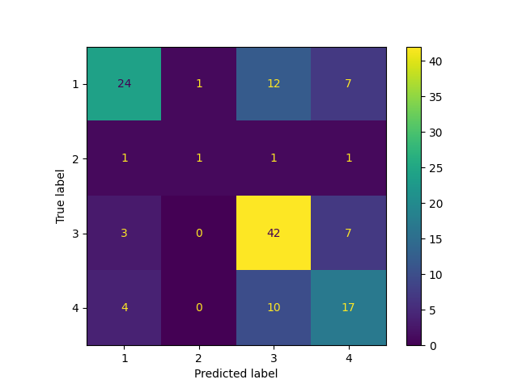

# Classification Report for Random Forest

## Parameter Search Results

|   rank_test_f1_weighted |   mean_test_f1_weighted |   mean_test_balanced_accuracy |   mean_fit_time | params                                                                                   |
|------------------------:|------------------------:|------------------------------:|----------------:|:-----------------------------------------------------------------------------------------|
|                       1 |                0.656029 |                      0.502304 |       0.801401  | {'randomforestclassifier__n_estimators': 385, 'randomforestclassifier__max_depth': 64}   |
|                       2 |                0.656    |                      0.502354 |       0.4922    | {'randomforestclassifier__n_estimators': 239, 'randomforestclassifier__max_depth': None} |
|                       3 |                0.652077 |                      0.500166 |       0.762199  | {'randomforestclassifier__n_estimators': 374, 'randomforestclassifier__max_depth': 256}  |
|                       4 |                0.647356 |                      0.496895 |       0.5966    | {'randomforestclassifier__n_estimators': 286, 'randomforestclassifier__max_depth': None} |
|                       5 |                0.645741 |                      0.494231 |       0.488     | {'randomforestclassifier__n_estimators': 225, 'randomforestclassifier__max_depth': 256}  |
|                       6 |                0.644961 |                      0.495593 |       0.7754    | {'randomforestclassifier__n_estimators': 359, 'randomforestclassifier__max_depth': 16}   |
|                       7 |                0.644632 |                      0.494871 |       0.9684    | {'randomforestclassifier__n_estimators': 439, 'randomforestclassifier__max_depth': 256}  |
|                       8 |                0.644321 |                      0.493162 |       0.807999  | {'randomforestclassifier__n_estimators': 380, 'randomforestclassifier__max_depth': 256}  |
|                       9 |                0.643228 |                      0.494834 |       0.7776    | {'randomforestclassifier__n_estimators': 357, 'randomforestclassifier__max_depth': None} |
|                      10 |                0.643015 |                      0.494714 |       0.342799  | {'randomforestclassifier__n_estimators': 167, 'randomforestclassifier__max_depth': 16}   |
|                      11 |                0.642991 |                      0.507147 |       0.8982    | {'randomforestclassifier__n_estimators': 442, 'randomforestclassifier__max_depth': 256}  |
|                      12 |                0.641311 |                      0.49255  |       0.8714    | {'randomforestclassifier__n_estimators': 427, 'randomforestclassifier__max_depth': 64}   |
|                      13 |                0.641091 |                      0.49255  |       0.657001  | {'randomforestclassifier__n_estimators': 307, 'randomforestclassifier__max_depth': 64}   |
|                      14 |                0.640802 |                      0.491151 |       0.8462    | {'randomforestclassifier__n_estimators': 390, 'randomforestclassifier__max_depth': 64}   |
|                      15 |                0.639939 |                      0.492481 |       0.3244    | {'randomforestclassifier__n_estimators': 154, 'randomforestclassifier__max_depth': 16}   |
|                      16 |                0.639731 |                      0.489936 |       0.933799  | {'randomforestclassifier__n_estimators': 458, 'randomforestclassifier__max_depth': 16}   |
|                      17 |                0.639532 |                      0.491101 |       0.649     | {'randomforestclassifier__n_estimators': 280, 'randomforestclassifier__max_depth': 64}   |
|                      18 |                0.639304 |                      0.491557 |       0.441199  | {'randomforestclassifier__n_estimators': 184, 'randomforestclassifier__max_depth': 16}   |
|                      19 |                0.639074 |                      0.490531 |       0.8634    | {'randomforestclassifier__n_estimators': 397, 'randomforestclassifier__max_depth': None} |
|                      20 |                0.638762 |                      0.490481 |       0.3402    | {'randomforestclassifier__n_estimators': 166, 'randomforestclassifier__max_depth': 256}  |
|                      21 |                0.638581 |                      0.488968 |       1.0024    | {'randomforestclassifier__n_estimators': 464, 'randomforestclassifier__max_depth': None} |
|                      22 |                0.638532 |                      0.488259 |       0.247399  | {'randomforestclassifier__n_estimators': 118, 'randomforestclassifier__max_depth': 16}   |
|                      23 |                0.638256 |                      0.489823 |       0.7548    | {'randomforestclassifier__n_estimators': 359, 'randomforestclassifier__max_depth': 64}   |
|                      24 |                0.638135 |                      0.488013 |       0.3148    | {'randomforestclassifier__n_estimators': 152, 'randomforestclassifier__max_depth': 16}   |
|                      25 |                0.637991 |                      0.488754 |       0.653199  | {'randomforestclassifier__n_estimators': 305, 'randomforestclassifier__max_depth': 256}  |
|                      26 |                0.637845 |                      0.487557 |       0.4528    | {'randomforestclassifier__n_estimators': 219, 'randomforestclassifier__max_depth': 64}   |
|                      27 |                0.637488 |                      0.488114 |       0.8528    | {'randomforestclassifier__n_estimators': 404, 'randomforestclassifier__max_depth': None} |
|                      28 |                0.636708 |                      0.487753 |       0.6502    | {'randomforestclassifier__n_estimators': 374, 'randomforestclassifier__max_depth': 16}   |
|                      29 |                0.636542 |                      0.489064 |       0.928998  | {'randomforestclassifier__n_estimators': 437, 'randomforestclassifier__max_depth': 64}   |
|                      30 |                0.635381 |                      0.485742 |       0.367401  | {'randomforestclassifier__n_estimators': 175, 'randomforestclassifier__max_depth': 16}   |
|                      31 |                0.634866 |                      0.486597 |       0.493599  | {'randomforestclassifier__n_estimators': 224, 'randomforestclassifier__max_depth': None} |
|                      32 |                0.634088 |                      0.484819 |       0.6046    | {'randomforestclassifier__n_estimators': 269, 'randomforestclassifier__max_depth': 16}   |
|                      33 |                0.634041 |                      0.484267 |       0.855399  | {'randomforestclassifier__n_estimators': 388, 'randomforestclassifier__max_depth': 64}   |
|                      34 |                0.633887 |                      0.485382 |       0.692599  | {'randomforestclassifier__n_estimators': 318, 'randomforestclassifier__max_depth': None} |
|                      35 |                0.633541 |                      0.486565 |       0.3688    | {'randomforestclassifier__n_estimators': 167, 'randomforestclassifier__max_depth': None} |
|                      36 |                0.633535 |                      0.486597 |       0.734799  | {'randomforestclassifier__n_estimators': 362, 'randomforestclassifier__max_depth': None} |
|                      37 |                0.633122 |                      0.484925 |       0.974     | {'randomforestclassifier__n_estimators': 448, 'randomforestclassifier__max_depth': 64}   |
|                      38 |                0.632465 |                      0.484033 |       0.472     | {'randomforestclassifier__n_estimators': 223, 'randomforestclassifier__max_depth': None} |
|                      39 |                0.63242  |                      0.486857 |       0.3078    | {'randomforestclassifier__n_estimators': 148, 'randomforestclassifier__max_depth': None} |
|                      40 |                0.632322 |                      0.485198 |       0.566397  | {'randomforestclassifier__n_estimators': 257, 'randomforestclassifier__max_depth': 64}   |
|                      41 |                0.632319 |                      0.485743 |       0.8152    | {'randomforestclassifier__n_estimators': 377, 'randomforestclassifier__max_depth': None} |
|                      42 |                0.632164 |                      0.484933 |       0.9098    | {'randomforestclassifier__n_estimators': 443, 'randomforestclassifier__max_depth': None} |
|                      43 |                0.632034 |                      0.485034 |       0.888602  | {'randomforestclassifier__n_estimators': 420, 'randomforestclassifier__max_depth': 256}  |
|                      44 |                0.631933 |                      0.483819 |       0.8556    | {'randomforestclassifier__n_estimators': 409, 'randomforestclassifier__max_depth': None} |
|                      45 |                0.631831 |                      0.483509 |       0.8446    | {'randomforestclassifier__n_estimators': 414, 'randomforestclassifier__max_depth': None} |
|                      46 |                0.631675 |                      0.482914 |       0.803     | {'randomforestclassifier__n_estimators': 387, 'randomforestclassifier__max_depth': 256}  |
|                      47 |                0.631465 |                      0.4828   |       0.3264    | {'randomforestclassifier__n_estimators': 160, 'randomforestclassifier__max_depth': None} |
|                      48 |                0.631325 |                      0.485231 |       0.4732    | {'randomforestclassifier__n_estimators': 229, 'randomforestclassifier__max_depth': 256}  |
|                      49 |                0.630293 |                      0.485491 |       0.637002  | {'randomforestclassifier__n_estimators': 292, 'randomforestclassifier__max_depth': 256}  |
|                      50 |                0.630248 |                      0.483827 |       0.697399  | {'randomforestclassifier__n_estimators': 311, 'randomforestclassifier__max_depth': 16}   |
|                      51 |                0.630123 |                      0.481548 |       0.9886    | {'randomforestclassifier__n_estimators': 420, 'randomforestclassifier__max_depth': 16}   |
|                      52 |                0.630011 |                      0.479762 |       0.358199  | {'randomforestclassifier__n_estimators': 173, 'randomforestclassifier__max_depth': 16}   |
|                      53 |                0.629612 |                      0.481187 |       0.4806    | {'randomforestclassifier__n_estimators': 233, 'randomforestclassifier__max_depth': 64}   |
|                      54 |                0.629294 |                      0.48244  |       0.639601  | {'randomforestclassifier__n_estimators': 300, 'randomforestclassifier__max_depth': 64}   |
|                      55 |                0.629284 |                      0.494076 |       0.257     | {'randomforestclassifier__n_estimators': 120, 'randomforestclassifier__max_depth': 256}  |
|                      56 |                0.627716 |                      0.480878 |       0.2094    | {'randomforestclassifier__n_estimators': 99, 'randomforestclassifier__max_depth': 256}   |
|                      57 |                0.627482 |                      0.480333 |       0.462399  | {'randomforestclassifier__n_estimators': 212, 'randomforestclassifier__max_depth': 16}   |
|                      58 |                0.626316 |                      0.481808 |       0.88      | {'randomforestclassifier__n_estimators': 405, 'randomforestclassifier__max_depth': 16}   |
|                      59 |                0.625584 |                      0.492773 |       0.3168    | {'randomforestclassifier__n_estimators': 153, 'randomforestclassifier__max_depth': 16}   |
|                      60 |                0.625567 |                      0.47772  |       0.4124    | {'randomforestclassifier__n_estimators': 190, 'randomforestclassifier__max_depth': 64}   |
|                      61 |                0.624615 |                      0.473621 |       0.0762    | {'randomforestclassifier__n_estimators': 35, 'randomforestclassifier__max_depth': 256}   |
|                      62 |                0.623133 |                      0.479689 |       0.142799  | {'randomforestclassifier__n_estimators': 67, 'randomforestclassifier__max_depth': 64}    |
|                      63 |                0.622348 |                      0.478419 |       0.3246    | {'randomforestclassifier__n_estimators': 140, 'randomforestclassifier__max_depth': 64}   |
|                      64 |                0.621867 |                      0.476667 |       0.1436    | {'randomforestclassifier__n_estimators': 69, 'randomforestclassifier__max_depth': 16}    |
|                      65 |                0.621864 |                      0.4749   |       0.1164    | {'randomforestclassifier__n_estimators': 55, 'randomforestclassifier__max_depth': 16}    |
|                      66 |                0.621671 |                      0.475184 |       0.2948    | {'randomforestclassifier__n_estimators': 145, 'randomforestclassifier__max_depth': 16}   |
|                      67 |                0.621358 |                      0.475361 |       0.1068    | {'randomforestclassifier__n_estimators': 48, 'randomforestclassifier__max_depth': 256}   |
|                      68 |                0.620958 |                      0.477309 |       0.3834    | {'randomforestclassifier__n_estimators': 172, 'randomforestclassifier__max_depth': 16}   |
|                      69 |                0.619648 |                      0.474078 |       0.5486    | {'randomforestclassifier__n_estimators': 259, 'randomforestclassifier__max_depth': 64}   |
|                      70 |                0.605652 |                      0.476127 |       0.0265997 | {'randomforestclassifier__n_estimators': 11, 'randomforestclassifier__max_depth': 16}    |
|                      71 |                0.599809 |                      0.454915 |       0.0391989 | {'randomforestclassifier__n_estimators': 17, 'randomforestclassifier__max_depth': 64}    |
|                      72 |                0.598481 |                      0.471956 |       0.0450006 | {'randomforestclassifier__n_estimators': 19, 'randomforestclassifier__max_depth': 256}   |
|                      73 |                0.598341 |                      0.456909 |       0.1828    | {'randomforestclassifier__n_estimators': 87, 'randomforestclassifier__max_depth': None}  |
|                      74 |                0.592388 |                      0.468202 |       0.0108002 | {'randomforestclassifier__n_estimators': 3, 'randomforestclassifier__max_depth': 256}    |
|                      75 |                0.589928 |                      0.44855  |       0.0345994 | {'randomforestclassifier__n_estimators': 13, 'randomforestclassifier__max_depth': None}  |
|                      76 |                0.574587 |                      0.430808 |       0.2148    | {'randomforestclassifier__n_estimators': 135, 'randomforestclassifier__max_depth': 4}    |
|                      77 |                0.573735 |                      0.430091 |       0.557     | {'randomforestclassifier__n_estimators': 342, 'randomforestclassifier__max_depth': 4}    |
|                      78 |                0.573654 |                      0.430091 |       0.8228    | {'randomforestclassifier__n_estimators': 404, 'randomforestclassifier__max_depth': 4}    |
|                      79 |                0.572696 |                      0.430237 |       0.523998  | {'randomforestclassifier__n_estimators': 329, 'randomforestclassifier__max_depth': 4}    |
|                      80 |                0.571772 |                      0.427884 |       0.670001  | {'randomforestclassifier__n_estimators': 414, 'randomforestclassifier__max_depth': 4}    |
|                      81 |                0.570096 |                      0.427012 |       0.760999  | {'randomforestclassifier__n_estimators': 465, 'randomforestclassifier__max_depth': 4}    |
|                      82 |                0.570091 |                      0.42746  |       0.696     | {'randomforestclassifier__n_estimators': 438, 'randomforestclassifier__max_depth': 4}    |
|                      83 |                0.569952 |                      0.427866 |       0.210201  | {'randomforestclassifier__n_estimators': 129, 'randomforestclassifier__max_depth': 4}    |
|                      84 |                0.569841 |                      0.426865 |       0.579401  | {'randomforestclassifier__n_estimators': 295, 'randomforestclassifier__max_depth': 4}    |
|                      85 |                0.569773 |                      0.426865 |       0.6506    | {'randomforestclassifier__n_estimators': 394, 'randomforestclassifier__max_depth': 4}    |
|                      86 |                0.568304 |                      0.425961 |       0.597399  | {'randomforestclassifier__n_estimators': 359, 'randomforestclassifier__max_depth': 4}    |
|                      87 |                0.568132 |                      0.425993 |       0.400999  | {'randomforestclassifier__n_estimators': 249, 'randomforestclassifier__max_depth': 4}    |
|                      88 |                0.567775 |                      0.425847 |       0.7476    | {'randomforestclassifier__n_estimators': 459, 'randomforestclassifier__max_depth': 4}    |
|                      89 |                0.567559 |                      0.426253 |       0.6434    | {'randomforestclassifier__n_estimators': 388, 'randomforestclassifier__max_depth': 4}    |
|                      90 |                0.56665  |                      0.42438  |       0.182001  | {'randomforestclassifier__n_estimators': 104, 'randomforestclassifier__max_depth': 4}    |
|                      91 |                0.566574 |                      0.424234 |       0.4524    | {'randomforestclassifier__n_estimators': 257, 'randomforestclassifier__max_depth': 4}    |
|                      92 |                0.565925 |                      0.42438  |       0.279     | {'randomforestclassifier__n_estimators': 166, 'randomforestclassifier__max_depth': 4}    |
|                      93 |                0.564919 |                      0.424234 |       0.3272    | {'randomforestclassifier__n_estimators': 179, 'randomforestclassifier__max_depth': 4}    |
|                      94 |                0.56461  |                      0.42438  |       0.729     | {'randomforestclassifier__n_estimators': 452, 'randomforestclassifier__max_depth': 4}    |
|                      95 |                0.563053 |                      0.422767 |       0.5548    | {'randomforestclassifier__n_estimators': 327, 'randomforestclassifier__max_depth': 4}    |
|                      96 |                0.561109 |                      0.421602 |       0.3712    | {'randomforestclassifier__n_estimators': 225, 'randomforestclassifier__max_depth': 4}    |
|                      97 |                0.555755 |                      0.423307 |       0.0246    | {'randomforestclassifier__n_estimators': 9, 'randomforestclassifier__max_depth': None}   |
|                      98 |                0.555535 |                      0.417358 |       0.2608    | {'randomforestclassifier__n_estimators': 157, 'randomforestclassifier__max_depth': 4}    |
|                      99 |                0.550319 |                      0.413177 |       0.0303996 | {'randomforestclassifier__n_estimators': 10, 'randomforestclassifier__max_depth': 4}     |
|                     100 |                0.547804 |                      0.412888 |       0.0149995 | {'randomforestclassifier__n_estimators': 6, 'randomforestclassifier__max_depth': 4}      |

## Best Classifier Found

```
Pipeline(steps=[('standardscaler', StandardScaler()),
                ('randomforestclassifier',
                 RandomForestClassifier(max_depth=64, n_estimators=385))])
{'randomforestclassifier__n_estimators': 385, 'randomforestclassifier__max_depth': 64}
```

### Training report

```
              precision    recall  f1-score   support

           1       0.99      0.99      0.99       130
           2       0.93      1.00      0.97        14
           3       0.99      1.00      0.99       156
           4       1.00      0.97      0.98        92

    accuracy                           0.99       392
   macro avg       0.98      0.99      0.98       392
weighted avg       0.99      0.99      0.99       392
```

### Testing report

```
              precision    recall  f1-score   support

           1       0.75      0.55      0.63        44
           2       0.50      0.25      0.33         4
           3       0.65      0.81      0.72        52
           4       0.53      0.55      0.54        31

    accuracy                           0.64       131
   macro avg       0.61      0.54      0.56       131
weighted avg       0.65      0.64      0.64       131
```
### Confusion matrix



