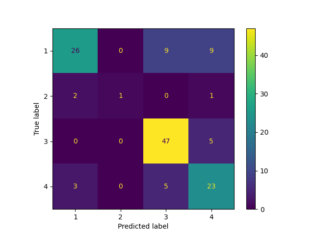

# Classification Report for Support Vector Machine

## Parameter Search Results

|   rank_test_f1_weighted |   mean_test_f1_weighted |   mean_test_balanced_accuracy |   mean_fit_time | params                                                     |
|------------------------:|------------------------:|------------------------------:|----------------:|:-----------------------------------------------------------|
|                       1 |                0.71152  |                      0.594949 |      0.0170003  | {'svc__C': 215.67367368699792, 'svc__kernel': 'rbf'}       |
|                       2 |                0.708866 |                      0.59059  |      0.0176005  | {'svc__C': 271.7833896527901, 'svc__kernel': 'rbf'}        |
|                       3 |                0.707402 |                      0.589849 |      0.0195996  | {'svc__C': 332.5160670319884, 'svc__kernel': 'rbf'}        |
|                       4 |                0.706924 |                      0.591589 |      0.0253985  | {'svc__C': 567.7202086696135, 'svc__kernel': 'rbf'}        |
|                       5 |                0.702641 |                      0.598912 |      0.0307994  | {'svc__C': 885.6515339234714, 'svc__kernel': 'rbf'}        |
|                       6 |                0.702108 |                      0.587743 |      0.0219999  | {'svc__C': 438.8822501076388, 'svc__kernel': 'rbf'}        |
|                       7 |                0.698315 |                      0.592519 |      0.2452     | {'svc__C': 31.636345043181166, 'svc__kernel': 'linear'}    |
|                       8 |                0.697485 |                      0.564659 |      0.0143999  | {'svc__C': 112.03869841967261, 'svc__kernel': 'rbf'}       |
|                       9 |                0.697118 |                      0.58144  |      0.0167995  | {'svc__C': 187.31363984802368, 'svc__kernel': 'rbf'}       |
|                      10 |                0.692943 |                      0.577506 |      0.0161981  | {'svc__C': 162.05339696343228, 'svc__kernel': 'rbf'}       |
|                      10 |                0.692943 |                      0.577506 |      0.0166001  | {'svc__C': 169.21131905576897, 'svc__kernel': 'rbf'}       |
|                      12 |                0.692865 |                      0.585534 |      0.461999   | {'svc__C': 55.37786003913442, 'svc__kernel': 'linear'}     |
|                      13 |                0.692756 |                      0.587864 |      0.548199   | {'svc__C': 62.5347578610609, 'svc__kernel': 'linear'}      |
|                      13 |                0.692756 |                      0.587864 |      0.555599   | {'svc__C': 63.53461947392344, 'svc__kernel': 'linear'}     |
|                      15 |                0.68531  |                      0.581911 |      1.1094     | {'svc__C': 149.84095058497098, 'svc__kernel': 'linear'}    |
|                      16 |                0.682573 |                      0.580092 |      5.893      | {'svc__C': 946.9763399794197, 'svc__kernel': 'linear'}     |
|                      17 |                0.681736 |                      0.565332 |      0.0451988  | {'svc__C': 4.158868439391326, 'svc__kernel': 'linear'}     |
|                      18 |                0.680454 |                      0.578383 |      4.1898     | {'svc__C': 617.9359446866864, 'svc__kernel': 'linear'}     |
|                      19 |                0.680099 |                      0.578375 |      0.911399   | {'svc__C': 129.49117601766207, 'svc__kernel': 'linear'}    |
|                      20 |                0.679826 |                      0.57721  |      0.7648     | {'svc__C': 105.11098835925642, 'svc__kernel': 'linear'}    |
|                      21 |                0.677284 |                      0.575245 |      2.0638     | {'svc__C': 286.2983340003781, 'svc__kernel': 'linear'}     |
|                      22 |                0.676614 |                      0.546852 |      0.0120013  | {'svc__C': 19.33025718384591, 'svc__kernel': 'rbf'}        |
|                      23 |                0.675616 |                      0.544618 |      0.014599   | {'svc__C': 14.839514635760993, 'svc__kernel': 'rbf'}       |
|                      24 |                0.674425 |                      0.545239 |      0.0117988  | {'svc__C': 20.036610446543722, 'svc__kernel': 'rbf'}       |
|                      25 |                0.674386 |                      0.573992 |      1.769      | {'svc__C': 372.7556162246122, 'svc__kernel': 'linear'}     |
|                      26 |                0.668494 |                      0.555989 |      0.0539994  | {'svc__C': 6.1805166621257985, 'svc__kernel': 'linear'}    |
|                      27 |                0.667711 |                      0.551006 |      0.0233996  | {'svc__C': 1.2809220426280692, 'svc__kernel': 'linear'}    |
|                      28 |                0.624071 |                      0.488609 |      0.0153996  | {'svc__C': 0.3501934468346743, 'svc__kernel': 'linear'}    |
|                      29 |                0.621294 |                      0.481992 |      0.0116002  | {'svc__C': 5.580600427192331, 'svc__kernel': 'rbf'}        |
|                      30 |                0.609768 |                      0.476886 |      0.0157985  | {'svc__C': 0.30062376038892524, 'svc__kernel': 'linear'}   |
|                      31 |                0.603939 |                      0.469104 |      0.00779977 | {'svc__C': 5.121866315959796, 'svc__kernel': 'rbf'}        |
|                      32 |                0.599192 |                      0.492056 |      0.1466     | {'svc__C': 379.52358642950173, 'svc__kernel': 'poly'}      |
|                      33 |                0.598402 |                      0.466913 |      0.0125978  | {'svc__C': 0.18978990261137071, 'svc__kernel': 'linear'}   |
|                      34 |                0.595038 |                      0.451411 |      0.0129997  | {'svc__C': 0.16278349720255253, 'svc__kernel': 'linear'}   |
|                      35 |                0.584036 |                      0.440062 |      0.011999   | {'svc__C': 3.895309414884314, 'svc__kernel': 'rbf'}        |
|                      36 |                0.574848 |                      0.486479 |      0.0687991  | {'svc__C': 134.96777538154197, 'svc__kernel': 'poly'}      |
|                      37 |                0.570194 |                      0.428933 |      0.0112009  | {'svc__C': 3.1470709425325385, 'svc__kernel': 'rbf'}       |
|                      38 |                0.564081 |                      0.480089 |      0.055001   | {'svc__C': 86.8268529813218, 'svc__kernel': 'poly'}        |
|                      39 |                0.550214 |                      0.471689 |      0.0491988  | {'svc__C': 70.74473466087069, 'svc__kernel': 'poly'}       |
|                      40 |                0.496355 |                      0.434804 |      0.0285998  | {'svc__C': 18.676292759506932, 'svc__kernel': 'poly'}      |
|                      41 |                0.48689  |                      0.37702  |      0.0118005  | {'svc__C': 0.6917394651354728, 'svc__kernel': 'rbf'}       |
|                      41 |                0.48689  |                      0.37702  |      0.0110006  | {'svc__C': 0.7136850867087645, 'svc__kernel': 'rbf'}       |
|                      43 |                0.473664 |                      0.366741 |      0.0120003  | {'svc__C': 0.6326263112395537, 'svc__kernel': 'sigmoid'}   |
|                      44 |                0.466573 |                      0.362299 |      0.0105994  | {'svc__C': 0.75367887680744, 'svc__kernel': 'sigmoid'}     |
|                      45 |                0.456446 |                      0.361849 |      0.0110004  | {'svc__C': 0.2299542969456629, 'svc__kernel': 'rbf'}       |
|                      46 |                0.442139 |                      0.351748 |      0.0116002  | {'svc__C': 0.2264941204958938, 'svc__kernel': 'sigmoid'}   |
|                      47 |                0.427118 |                      0.342618 |      0.00959949 | {'svc__C': 0.0015446401676941345, 'svc__kernel': 'linear'} |
|                      48 |                0.423924 |                      0.340695 |      0.0125987  | {'svc__C': 0.08390027586489686, 'svc__kernel': 'sigmoid'}  |
|                      49 |                0.420132 |                      0.338462 |      0.0125999  | {'svc__C': 0.06973889683677693, 'svc__kernel': 'sigmoid'}  |
|                      50 |                0.414852 |                      0.334926 |      0.0098     | {'svc__C': 0.001211761510271412, 'svc__kernel': 'linear'}  |
|                      51 |                0.40721  |                      0.331739 |      0.00920014 | {'svc__C': 13.881790993717162, 'svc__kernel': 'sigmoid'}   |
|                      52 |                0.40459  |                      0.329156 |      0.0127992  | {'svc__C': 0.06235438836939942, 'svc__kernel': 'sigmoid'}  |
|                      53 |                0.403156 |                      0.326627 |      0.0109998  | {'svc__C': 1.2146726191700365, 'svc__kernel': 'sigmoid'}   |
|                      54 |                0.399153 |                      0.325287 |      0.00899916 | {'svc__C': 18.654937869774407, 'svc__kernel': 'sigmoid'}   |
|                      55 |                0.398367 |                      0.377514 |      0.0157996  | {'svc__C': 2.112899723620419, 'svc__kernel': 'poly'}       |
|                      56 |                0.398365 |                      0.376756 |      0.0161995  | {'svc__C': 5.339667723498423, 'svc__kernel': 'poly'}       |
|                      57 |                0.397812 |                      0.321751 |      0.00880032 | {'svc__C': 102.14617780940377, 'svc__kernel': 'sigmoid'}   |
|                      58 |                0.396626 |                      0.340024 |      0.00839987 | {'svc__C': 241.57910695085712, 'svc__kernel': 'sigmoid'}   |
|                      59 |                0.39569  |                      0.375591 |      0.0151999  | {'svc__C': 3.2690889891654393, 'svc__kernel': 'poly'}      |
|                      60 |                0.39479  |                      0.340335 |      0.00819945 | {'svc__C': 60.28926688101895, 'svc__kernel': 'sigmoid'}    |
|                      61 |                0.393292 |                      0.373978 |      0.0168009  | {'svc__C': 5.527269984947144, 'svc__kernel': 'poly'}       |
|                      62 |                0.39306  |                      0.323077 |      0.0117984  | {'svc__C': 0.059696925776475195, 'svc__kernel': 'rbf'}     |
|                      63 |                0.392105 |                      0.338412 |      0.0106005  | {'svc__C': 39.70151366402953, 'svc__kernel': 'sigmoid'}    |
|                      64 |                0.38685  |                      0.371201 |      0.0141987  | {'svc__C': 1.7294921158373935, 'svc__kernel': 'poly'}      |
|                      65 |                0.383616 |                      0.335206 |      0.0103993  | {'svc__C': 452.36475319612526, 'svc__kernel': 'sigmoid'}   |
|                      65 |                0.383616 |                      0.335206 |      0.00899978 | {'svc__C': 321.8778971534004, 'svc__kernel': 'sigmoid'}    |
|                      65 |                0.383616 |                      0.335206 |      0.0100005  | {'svc__C': 318.53917732568027, 'svc__kernel': 'sigmoid'}   |
|                      65 |                0.383616 |                      0.335206 |      0.0107996  | {'svc__C': 477.8478029294532, 'svc__kernel': 'sigmoid'}    |
|                      65 |                0.383616 |                      0.335206 |      0.0087997  | {'svc__C': 337.2482080030984, 'svc__kernel': 'sigmoid'}    |
|                      65 |                0.383616 |                      0.335206 |      0.00860062 | {'svc__C': 527.8848574599426, 'svc__kernel': 'sigmoid'}    |
|                      71 |                0.380049 |                      0.304657 |      0.00979748 | {'svc__C': 10.36756969275607, 'svc__kernel': 'sigmoid'}    |
|                      72 |                0.376826 |                      0.310288 |      0.0102004  | {'svc__C': 1.6962636517382317, 'svc__kernel': 'sigmoid'}   |
|                      73 |                0.37466  |                      0.308365 |      0.00960021 | {'svc__C': 1.9579400166607452, 'svc__kernel': 'sigmoid'}   |
|                      74 |                0.374265 |                      0.303664 |      0.00879974 | {'svc__C': 5.76384262595386, 'svc__kernel': 'sigmoid'}     |
|                      75 |                0.373135 |                      0.308839 |      0.0103992  | {'svc__C': 3.704885104079123, 'svc__kernel': 'sigmoid'}    |
|                      75 |                0.373135 |                      0.308839 |      0.00899925 | {'svc__C': 3.8371728193607573, 'svc__kernel': 'sigmoid'}   |
|                      77 |                0.372467 |                      0.308985 |      0.00799975 | {'svc__C': 2.1349368262085164, 'svc__kernel': 'sigmoid'}   |
|                      78 |                0.371369 |                      0.306916 |      0.00919933 | {'svc__C': 2.9037454488704375, 'svc__kernel': 'sigmoid'}   |
|                      79 |                0.369763 |                      0.305848 |      0.00939999 | {'svc__C': 3.4706696151005914, 'svc__kernel': 'sigmoid'}   |
|                      80 |                0.364022 |                      0.344608 |      0.0139997  | {'svc__C': 0.6666939570856605, 'svc__kernel': 'poly'}      |
|                      81 |                0.341547 |                      0.35807  |      0.0141993  | {'svc__C': 0.3052320785992087, 'svc__kernel': 'poly'}      |
|                      81 |                0.341547 |                      0.35807  |      0.0128005  | {'svc__C': 0.3293638438392705, 'svc__kernel': 'poly'}      |
|                      83 |                0.331963 |                      0.292308 |      0.0113982  | {'svc__C': 0.04034617366439667, 'svc__kernel': 'rbf'}      |
|                      84 |                0.320937 |                      0.333711 |      0.0149997  | {'svc__C': 0.17208501516346406, 'svc__kernel': 'poly'}     |
|                      85 |                0.314763 |                      0.306788 |      0.0138007  | {'svc__C': 0.14151961702569965, 'svc__kernel': 'poly'}     |
|                      86 |                0.296789 |                      0.276019 |      0.0122002  | {'svc__C': 0.10956377520798523, 'svc__kernel': 'poly'}     |
|                      87 |                0.263981 |                      0.26417  |      0.0112012  | {'svc__C': 0.08240427477691847, 'svc__kernel': 'poly'}     |
|                      88 |                0.259269 |                      0.262247 |      0.0115997  | {'svc__C': 0.06791259034879957, 'svc__kernel': 'poly'}     |
|                      89 |                0.254049 |                      0.26047  |      0.0131998  | {'svc__C': 0.036621864610783136, 'svc__kernel': 'poly'}    |
|                      90 |                0.243638 |                      0.256624 |      0.0118001  | {'svc__C': 0.009921878214669094, 'svc__kernel': 'poly'}    |
|                      91 |                0.238618 |                      0.254701 |      0.0106001  | {'svc__C': 0.008327552962817153, 'svc__kernel': 'poly'}    |
|                      92 |                0.233253 |                      0.252778 |      0.0111987  | {'svc__C': 0.002936300798678297, 'svc__kernel': 'poly'}    |
|                      92 |                0.233253 |                      0.252778 |      0.0116008  | {'svc__C': 0.0030106310482014282, 'svc__kernel': 'poly'}   |
|                      94 |                0.231977 |                      0.251215 |      0.0110002  | {'svc__C': 0.004230500563599059, 'svc__kernel': 'poly'}    |
|                      94 |                0.231977 |                      0.251215 |      0.0113991  | {'svc__C': 0.006131130247866113, 'svc__kernel': 'poly'}    |
|                      96 |                0.226583 |                      0.25     |      0.0114001  | {'svc__C': 0.013845954283634727, 'svc__kernel': 'rbf'}     |
|                      96 |                0.226583 |                      0.25     |      0.0141999  | {'svc__C': 0.001253084518870162, 'svc__kernel': 'sigmoid'} |
|                      96 |                0.226583 |                      0.25     |      0.011997   | {'svc__C': 0.0012869001457451402, 'svc__kernel': 'rbf'}    |
|                      96 |                0.226583 |                      0.25     |      0.0122004  | {'svc__C': 0.014263367548552796, 'svc__kernel': 'sigmoid'} |
|                      96 |                0.226583 |                      0.25     |      0.0110004  | {'svc__C': 0.004012313683967672, 'svc__kernel': 'rbf'}     |

## Best Classifier Found

```
Pipeline(steps=[('standardscaler', StandardScaler()),
                ('svc', SVC(C=215.67367368699792))])
{'svc__C': 215.67367368699792, 'svc__kernel': 'rbf'}
```

### Training report

```
              precision    recall  f1-score   support

           1       0.96      0.68      0.80       130
           2       1.00      0.64      0.78        14
           3       0.77      0.98      0.86       156
           4       0.85      0.84      0.84        92

    accuracy                           0.84       392
   macro avg       0.89      0.79      0.82       392
weighted avg       0.86      0.84      0.83       392
```

### Testing report

```
              precision    recall  f1-score   support

           1       0.84      0.59      0.69        44
           2       1.00      0.25      0.40         4
           3       0.77      0.90      0.83        52
           4       0.61      0.74      0.67        31

    accuracy                           0.74       131
   macro avg       0.80      0.62      0.65       131
weighted avg       0.76      0.74      0.73       131
```
### Confusion matrix



